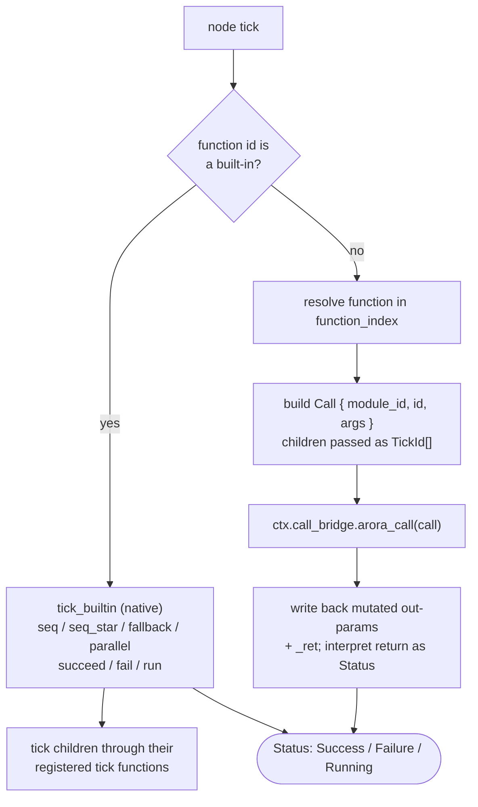
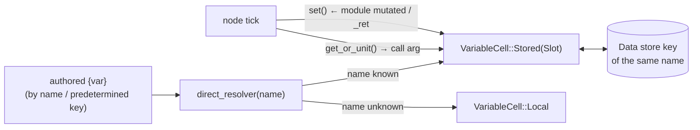

# Behavior-tree nodes — a concrete interpreter

This crate is one concrete implementation of the Arora behavior-interpreter contract. Read **[how a behavior interpreter works](../../arora-behavior/docs/interpreter-workflow.md)** first — this page assumes the load → tick → graph-update lifecycle described there and only covers what is *specific* to the behavior tree: what a node is, how a node ticks, and how nodes reach the data store and the engine's modules.

The interpreter type is [`BehaviorTreeInterpreter`](../src/behavior.rs#L35-L46). It implements [`BehaviorInterpreter`](../../arora-behavior/src/lib.rs#L93-L130): `tick` re-lowers the graph if dirty then runs the tree to a terminal status ([`behavior.rs:119-151`](../src/behavior.rs#L119-L151)); `apply(GraphDiff)` mutates its held graph and marks it dirty ([`behavior.rs:153-170`](../src/behavior.rs#L153-L170)); `load` replaces the whole behavior ([`behavior.rs:172-179`](../src/behavior.rs#L172-L179)). It maps onto the shared lifecycle like this:

| Interpreter lifecycle | Behavior tree |
|---|---|
| load | `load` / `load_graph` / `load_groot`, or first `apply` onto an empty graph ([`behavior.rs:72-110`](../src/behavior.rs#L72-L110)) |
| time update | no hook — nodes read the golden `arora/dt` from the store like any slot |
| tick | run-once-per-tick: re-lower if dirty, then run the tree to `Success`/`Failure`; idle → `Running` ([`behavior.rs:119-151`](../src/behavior.rs#L119-L151)) |
| graph update | `apply(GraphDiff)` sets `dirty`; the next tick re-lowers against the live store ([`behavior.rs:123-139`](../src/behavior.rs#L123-L139)) |

## What a node is

A tree node is **a `function` UUID + argument expressions + optional child ids** ([`schema::Node`, `schema.rs:21-39`](../src/schema.rs#L21-L39)):

```rust
pub struct Node {
    pub id: Uuid,
    pub function: Uuid,                          // what this node does
    pub arguments: HashMap<Uuid, Expression>,   // its inputs
    pub children: Option<Vec<Uuid>>,            // ordered children, if any
}
```

There is **one node kind**; the `function` id is the sole discriminant. The runtime either handles that id **natively** (a built-in control node) or **dispatches it as a module call** — the same homogeneous split the shared graph model describes ([`arora-behavior/src/graph.rs:5-9`](../../arora-behavior/src/graph.rs#L5-L9)). Arguments are [`Expression`s](../src/schema.rs#L48-L64): a literal `Value`, a blackboard variable id (`{var}` shared across nodes), another node's argument slot, or a nested `Call` evaluated every tick.

### Node tick status vs. interpreter status

A node's tick returns a three-state [`Status`](../src/arora_generated/behavior_tree/status.rs#L5-L10) — `Success | Failure | Running`. This is distinct from the interpreter-level [`BehaviorStatus`](../../arora-behavior/src/lib.rs#L47-L53) (`Running | Done`): a whole tree runs to a terminal `Success`/`Failure` each interpreter tick, so `BehaviorTreeInterpreter::tick` reports `Done` ([`behavior.rs:145-150`](../src/behavior.rs#L145-L150)); an empty interpreter idles as `Running`.

This is the sharpest contrast with Vizij's node graph, whose nodes are dataflow (they produce values, not a Success/Failure/Running status) and whose interpreter runs forever (`Running`) — see [the parallels in the NodeGraph doc](https://github.com/vizij-ai/vizij-rs/blob/main/crates/interop/vizij-arora-behavior/docs/node-graph.md).

### Built-in control nodes

The basic control nodes and status leaves are wired into this crate and dispatched natively (no engine round-trip). Builders in [`nodes.rs`](../src/nodes.rs): `seq` ([`:141`](../src/nodes.rs#L141)), `seq_star` ([`:146`](../src/nodes.rs#L146), resumes past already-succeeded children via a persisted index), `fallback` ([`:158`](../src/nodes.rs#L158)), `parallel` ([`:163`](../src/nodes.rs#L163)), and the leaves `succeed`/`fail`/`run` ([`:13-23`](../src/nodes.rs#L13-L23)).

## How a node ticks



Native dispatch is [`tick_builtin`](../src/behavior_tree.rs#L159-L269): `SEQ` short-circuits on the first non-`Success` child; `FALLBACK` on the first non-`Failure`; `PARALLEL` ticks every child and succeeds only if all did; `SEQ_STAR` resumes from a persisted `current_index`. Any non-built-in function is resolved in the `function_index` and dispatched through the engine ([`behavior_tree.rs:271-436`](../src/behavior_tree.rs#L271-L436)). At setup, **every node is registered on the engine as a callable** and wrapped in a `TickId`, so children can be invoked through the call bridge ([`setup_tick_function`, `behavior_tree.rs:104-152`](../src/behavior_tree.rs#L104-L152)).

## How nodes interact with the data store

A node never touches `DataStore` directly. Its arguments are bound at build time to **[`VariableCell`s](../src/variable.rs#L16-L23)**, and a cell is the whole store-interaction surface:

```rust
pub enum VariableCell {
    Local(Rc<RefCell<Option<Value>>>),   // tree-local scratch, no store backing
    Stored(Rc<dyn Slot>),                // a handle into the host data store
}
```

A `Stored` cell wraps a [`Slot`](../../arora-types/src/data/store.rs#L49-L54) — a direct handle to one store key's cell, resolved once so `get`/`set` skip re-resolving the path each tick. Which one a `{var}` becomes is decided when the tree is lowered, by the **Direct convention** (the variable's name *is* the store key): [`direct_resolver`](../src/behavior.rs#L48-L52) hands back `store.slot(&Key::from(name))`, and the first reference to a variable binds it to that store slot if the resolver knows the name, else a tree-local cell ([`behavior_tree.rs:611-630`](../src/behavior_tree.rs#L611-L630)).



So a **read** is a node filling a call argument from `variable.get_or_unit()`, and a **write** is the tick calling `variable.set(...)` when a module reports a mutated parameter or a `_ret` return ([`behavior_tree.rs:401-431`](../src/behavior_tree.rs#L401-L431)). Because a store-backed cell's `set` goes straight to the `Slot`, a node's output lands in the store key of the same name. Verified by [`resolved_variable_is_store_backed`](../src/tests.rs#L93-L144).

## How nodes interact with modules

A node whose function id is not a built-in is dispatched into the engine ([`behavior_tree.rs:271-436`](../src/behavior_tree.rs#L271-L436)):

1. **Resolve** the function in the `function_index` → a `ModuleFunction { module_id, function_id, … }` ([`behavior_tree.rs:289-295`](../src/behavior_tree.rs#L289-L295)).
2. **Build a `Call`** carrying the module id and the node's function id ([`behavior_tree.rs:297-303`](../src/behavior_tree.rs#L297-L303)).
3. **Pass children as `TickId`s** — a node with children requires its function's first parameter to be a `children` array of `TickId`; each child's registered `callable_id` is packed in, which is how a control-flow *module* re-enters the tree ([`behavior_tree.rs:312-365`](../src/behavior_tree.rs#L312-L365)).
4. **Resolve remaining args** from the node's variable cells ([`behavior_tree.rs:371-405`](../src/behavior_tree.rs#L371-L405)).
5. **Invoke** `ctx.call_bridge.arora_call(call)` ([`behavior_tree.rs:408-410`](../src/behavior_tree.rs#L408-L410)).
6. **Write back** each mutated out-parameter into its variable ([`behavior_tree.rs:412-422`](../src/behavior_tree.rs#L412-L422)).
7. **Interpret the result**: a node that bound the special `_ret` parameter captures the return value into a variable and reports `Success`; otherwise the module's return value is read as a `Status` ([`behavior_tree.rs:426-435`](../src/behavior_tree.rs#L426-L435)).

This is the tree's version of what the shared model calls a module call. (The `GraphHost`/`ModuleCall` vocabulary belongs to Vizij's node-graph interpreter; here the mechanism is function-id-routed `arora_call` dispatch.) The engine module surface is the same `CallBridge` an interpreter receives in its `BehaviorContext`.

## Editing a running tree

`apply(GraphDiff)` mutates the retained [`Graph`](../../arora-behavior/src/graph.rs#L146-L162) and sets `dirty`; the next `tick` re-lowers via `build_behavior_tree(graph, &direct_resolver(ctx.store))` ([`behavior.rs:123-139`](../src/behavior.rs#L123-L139)). Lowering ([`graph.rs`](../src/graph.rs)) turns the shared model's links into node argument expressions and binds predetermined, unlinked slots to the store variable named by their key ([`graph.rs:74-103`](../src/graph.rs#L74-L103)). A raw `BehaviorTree` loaded with `load` (no authored graph) ticks fine but rejects `apply` ([`behavior.rs:160-164`](../src/behavior.rs#L160-L164)). The end-to-end "build a graph, run it, edit it via a diff, re-run" example is [`seq_of_builtins_lowers_and_runs`](../src/graph.rs#L219-L242).

## Source map

| Concept | File |
|---|---|
| The interpreter (`tick`/`apply`/`load`) | [`crates/arora-behavior-tree/src/behavior.rs`](../src/behavior.rs) |
| Runtime tree, native dispatch, module dispatch, `TickId` | [`crates/arora-behavior-tree/src/behavior_tree.rs`](../src/behavior_tree.rs) |
| Node/`Expression` schema | [`crates/arora-behavior-tree/src/schema.rs`](../src/schema.rs) |
| Built-in control nodes + leaves | [`crates/arora-behavior-tree/src/nodes.rs`](../src/nodes.rs) |
| `VariableCell` (store binding) | [`crates/arora-behavior-tree/src/variable.rs`](../src/variable.rs) |
| Lowering the shared `Graph` → runnable tree | [`crates/arora-behavior-tree/src/graph.rs`](../src/graph.rs) |
| `Status` enum | [`crates/arora-behavior-tree/src/arora_generated/behavior_tree/status.rs`](../src/arora_generated/behavior_tree/status.rs) |
| The interpreter contract this satisfies | [`arora-behavior/docs/interpreter-workflow.md`](../../arora-behavior/docs/interpreter-workflow.md) |

Tests: native control-node semantics ([`tests.rs:267-409`](../src/tests.rs#L267-L409)), store round-trip ([`tests.rs:93-144`](../src/tests.rs#L93-L144)), fresh-interpreter edit + idle ([`tests.rs:411-438`](../src/tests.rs#L411-L438)), graph lower/edit/run and predetermined keys ([`graph.rs:219-420`](../src/graph.rs#L219-L420)).
