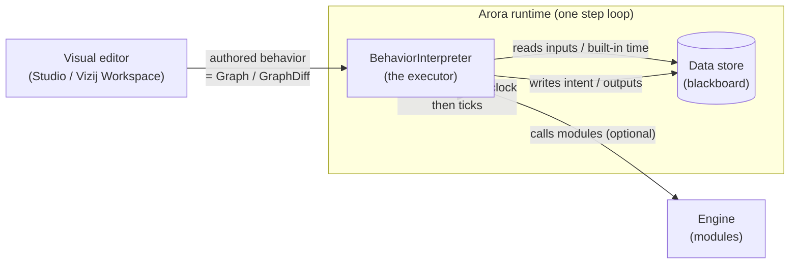
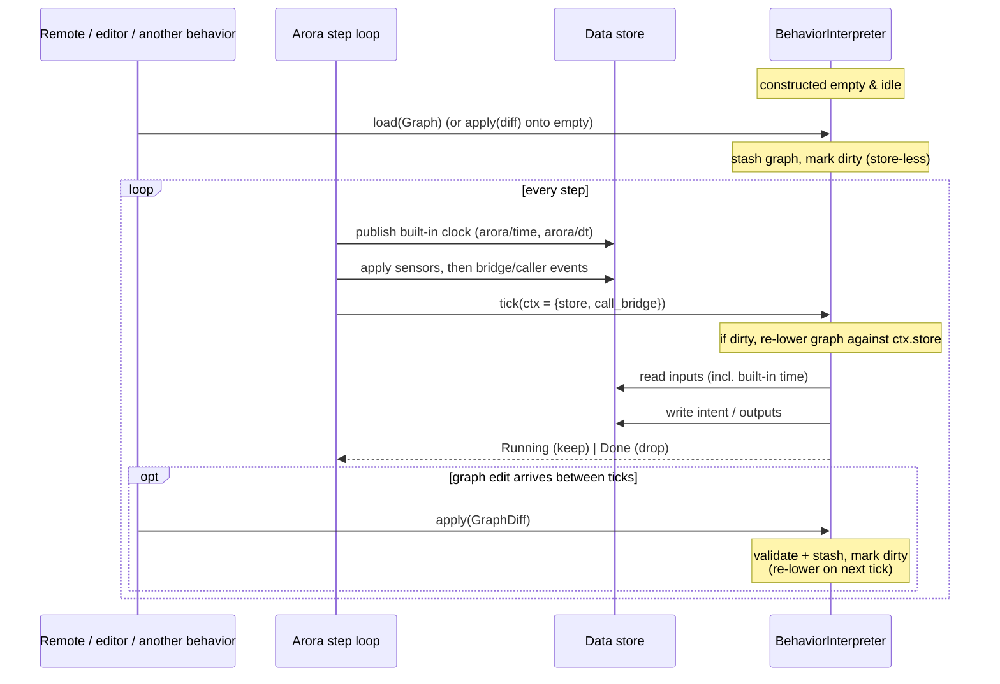
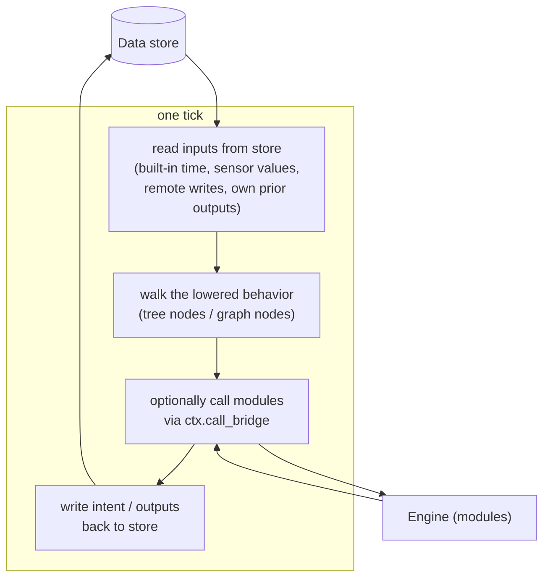

# How a behavior interpreter works — load, tick, and graph updates

This page explains the workflow the Arora runtime drives a **behavior interpreter** through: how a behavior is loaded, how it is ticked each frame, how it relates to the data store, and how a running behavior is edited. The diagrams are grounded in the actual code — every box and step links to the source that implements it.

Two words are deliberately distinguished throughout ([`lib.rs` module doc, lines 1–35](../src/lib.rs#L1-L35)):

- A **behavior** (the noun) is *authored, editable data* — a behavior tree, a node graph — produced in a visual editor and shipped as a [`Graph`](../src/graph.rs#L146-L162).
- A **[`BehaviorInterpreter`](../src/lib.rs#L93-L130)** is the *runtime executor* that runs one such behavior. The runtime holds exactly one `Box<dyn BehaviorInterpreter>` and ticks it; loading a new behavior into it (or editing the one it holds) is how you change what the device does.

> The interpreter is `!Send` on purpose — the runtime is a single-owner, single-thread step loop ([`lib.rs:79-92`](../src/lib.rs#L79-L92)).

## The pieces at a glance

The authored behavior is *only data*: the [`graph`](../src/graph.rs) module is the shared model (nodes bound to functions, typed I/Os, links) and knows nothing about ticking. Each interpreter lowers that shared model into its own runtime form and walks it however it likes — a behavior tree reads links as argument/child edges; a node graph reads them as dataflow ([`graph.rs:1-22`](../src/graph.rs#L1-L22)).

## The trait: three methods

Defined at [`lib.rs:93-130`](../src/lib.rs#L93-L130). Only `tick` is required; `apply` and `load` default to rejecting the operation, so a hand-coded, non-graph interpreter can implement just `tick`.

| Method | Signature | Called | Source |
|---|---|---|---|
| `tick` | `fn tick(&mut self, ctx: &mut BehaviorContext) -> Result<BehaviorStatus, BehaviorError>` | every frame | [`lib.rs:96`](../src/lib.rs#L96) |
| `apply` | `fn apply(&mut self, diff: GraphDiff) -> Result<(), BehaviorError>` | on a graph edit | [`lib.rs:112`](../src/lib.rs#L112) |
| `load` | `fn load(&mut self, graph: Graph) -> Result<(), BehaviorError>` | on a whole-behavior load | [`lib.rs:124`](../src/lib.rs#L124) |

Each `tick` receives a [`BehaviorContext`](../src/lib.rs#L57-L62): the shared `store: &dyn DataStore` (read inputs, write intent/outputs) and `call_bridge: &mut dyn CallBridge` (the engine, for interpreters that call modules). It returns a [`BehaviorStatus`](../src/lib.rs#L47-L53) — `Running` (tick me again) or `Done` (drop me).

## The lifecycle

### 1. Load

A behavior is loaded into an interpreter as a whole [`Graph`](../src/graph.rs#L146-L162) via [`load`](../src/lib.rs#L124), or built up from an empty graph by [`apply`](../src/lib.rs#L112)ing a [`GraphDiff`](../src/graph.rs#L186-L211) — *loading a fresh behavior is exactly applying a diff onto an empty graph* ([`lib.rs:98-100`](../src/lib.rs#L98-L100), [`graph.rs:19-22`](../src/graph.rs#L19-L22)).

`load` and `apply` are **store-less** by design ([`lib.rs:119-123`](../src/lib.rs#L119-L123)): they only receive graph data, no store. An interpreter is free to just validate and stash the new behavior and defer turning it into its runnable form until the next `tick` (which does carry the store). That is what makes both methods reachable from anywhere a graph arrives — including the interpreter's own engine-registered load/edit functions, which hold no store (see [Graph updates](#4-graph-updates)).

The runtime injects one interpreter at build time; if none is supplied it defaults to an empty, idle behavior tree ([`arora/src/lib.rs:451-479`](../../arora/src/lib.rs#L451-L479)). An empty interpreter is not an error — it simply idles (returns `Running`) until a behavior is loaded.

### 2. Time update — the store↔behavior relationship

There is **no separate "time update" method**. Timing is *data*, not a tick argument. Before it ticks any behavior, the runtime writes the frame's clock into the store under two reserved **built-in keys** ([`built_in.rs`](../src/built_in.rs)):

| Key | Meaning | Constant |
|---|---|---|
| `arora/time` | monotonic nanoseconds since start (`U64`) | [`built_in.rs:26`](../src/built_in.rs#L26) |
| `arora/dt` | nanoseconds elapsed since the previous step (`U64`) | [`built_in.rs:31`](../src/built_in.rs#L31) |

An interpreter that needs elapsed time reads `arora/dt` from `ctx.store` like any other slot ([`lib.rs:33-35`](../src/lib.rs#L33-L35), [`built_in.rs:1-16`](../src/built_in.rs#L1-L16)). The runtime publishes them in phase 1 of the step, before sensors, events, or the behavior touch the store ([`arora/src/runtime.rs:207-218`](../../arora/src/runtime.rs#L207-L218)).

More broadly, **the store is the entire relationship between the runtime and a behavior**. The store is path-keyed and uses interior mutability (`&self` for both read and write), so one store can be shared by the HAL, the bridge, and the interpreter at once ([`arora-types/src/data/store.rs:1-14`](../../arora-types/src/data/store.rs#L1-L14)) — which is why `BehaviorContext.store` is a shared `&dyn DataStore` yet the interpreter can still write to it.

**Interpreters have wide freedom in how they use the store.** The crate imposes no convention beyond the reserved `arora/` built-in namespace: a node graph can treat links as dataflow over store slots; a behavior tree binds its authored variables to store slots by name and drives the call bridge instead ([`graph.rs:12-16`](../src/graph.rs#L12-L16)). For a concrete, worked example of one interpreter's store discipline — the behavior tree's `VariableCell` (tree-local scratch vs. a `Slot` handle into the store, bound once at build under the "Direct" name==key convention) — see **[arora-behavior-tree/docs/nodes.md](../../arora-behavior-tree/docs/nodes.md)**.

### 3. Ticks — how data flows

Each step the runtime ticks the one interpreter **last**, after the clock, sensors, and bridge/caller events have already been applied to the store — so the behavior is the frame's final writer and sees everything that happened this frame ([`arora/src/runtime.rs:379-421`](../../arora/src/runtime.rs#L379-L421)).

Concretely, `tick` gets `ctx.store` and `ctx.call_bridge` ([`lib.rs:57-62`](../src/lib.rs#L57-L62)). It reads whatever slots it cares about, does its work (which may include calling engine modules through the call bridge), and writes its results back into the store with `store.write(...)`. Those writes are coalesced by the runtime after the tick and fanned out to the HAL and to any subscribed bridges ([`arora/src/runtime.rs:427-475`](../../arora/src/runtime.rs#L427-L475)). Per-key precedence within a frame is **behavior ▸ bridge ▸ HAL ▸ previous frame** — the behavior's writes win ([`arora/src/runtime.rs:486-492`](../../arora/src/runtime.rs#L486-L492)).

### 4. Graph updates

A running behavior is edited by applying a [`GraphDiff`](../src/graph.rs#L186-L211) — add/remove nodes and links, set predetermined keys, set the root, declare variables — applied in a fixed order so one diff can delete and rebuild a region atomically ([`graph.rs:179-211`](../src/graph.rs#L179-L211), applied by [`Graph::apply`, `graph.rs:251-299`](../src/graph.rs#L251-L299)).

The interpreter-level [`apply`](../src/lib.rs#L112) typically only *validates and stashes* the edit (mutating its held `Graph` and marking itself dirty), **deferring the actual re-lowering to the next `tick`**, where the store is available ([`lib.rs:98-117`](../src/lib.rs#L98-L117)). This keeps `apply` callable from anywhere a diff arrives.

Where does a diff arrive from? The interpreter is also exposed **as an engine module** so a remote `Call` or even another behavior can load/edit it over the ordinary dispatch path ([`interpreter_module.rs:1-19`](../src/interpreter_module.rs#L1-L19)). It has self-identifying well-known UUIDs (the ASCII bytes of `arora` lead the id):

| Id | Purpose | Constant |
|---|---|---|
| `ID` | the interpreter module | [`interpreter_module.rs:33`](../src/interpreter_module.rs#L33) |
| `LOAD` | → `BehaviorInterpreter::load` (a whole `Graph`) | [`interpreter_module.rs:43`](../src/interpreter_module.rs#L43) |
| `EDIT` | → `BehaviorInterpreter::apply` (a `GraphDiff`) | [`interpreter_module.rs:36`](../src/interpreter_module.rs#L36) |

The `arora` crate wires these ids to the live interpreter cell ([`arora/src/lib.rs:461-479`](../../arora/src/lib.rs#L461-L479)); payloads round-trip as one structured `Value` ([`interpreter_module.rs:50-100`](../src/interpreter_module.rs#L50-L100)). Editing an interpreter from *inside its own tick* is refused cleanly rather than racing, because the interpreter cell is already borrowed for the tick ([`arora/src/runtime.rs:360-366`](../../arora/src/runtime.rs#L360-L366)).

Not every interpreter supports incremental edits. The behavior tree does (it re-lowers on the next tick); Vizij's node graph rejects `GraphDiff` and treats every edit as a whole-spec `load` — see the contrast in [the Vizij NodeGraph doc](https://github.com/vizij-ai/vizij-rs/blob/main/crates/interop/vizij-arora-behavior/docs/node-graph.md).

### 5. Keeps ticking

After each tick the runtime reads the returned [`BehaviorStatus`](../src/lib.rs#L47-L53):

- **`Running`** → the interpreter stays installed and is ticked again next step. A node graph runs forever; a behavior tree that is still running reports `Running`. An interpreter with no behavior loaded idles as `Running` ([`arora-behavior-tree/src/behavior.rs:142-144`](../../arora-behavior-tree/src/behavior.rs#L142-L144)).
- **`Done`** → the interpreter reached a terminal state; the runtime drops it (sets the cell to `None`) ([`arora/src/runtime.rs:404-412`](../../arora/src/runtime.rs#L404-L412)).

A **failing** tick is *state, not a stop*: the behavior stays installed and retries next step, and the error is surfaced on a watch channel (cleared on the next success) rather than halting the device ([`arora/src/runtime.rs:413-420`](../../arora/src/runtime.rs#L413-L420)). See the end-to-end test [`a_failing_behavior_is_state_not_a_stop`](../../arora/src/lib.rs#L615-L678).

## A concrete interpreter

The fully worked reference implementation of all three methods — including the dirty/defer-lowering pattern, store-slot binding, and idle-when-empty semantics — is the behavior tree's [`BehaviorTreeInterpreter`](../../arora-behavior-tree/src/behavior.rs#L35-L180). See **[arora-behavior-tree/docs/nodes.md](../../arora-behavior-tree/docs/nodes.md)** for what its nodes are and how they touch the store and modules, and **[the arora runtime doc](../../arora/docs/runtime-and-data-flow.md)** for the full step loop that drives all of this.

## Source map

| Concept | File |
|---|---|
| `BehaviorInterpreter` trait, `BehaviorContext`, `BehaviorStatus` | [`crates/arora-behavior/src/lib.rs`](../src/lib.rs) |
| Shared graph model, `GraphDiff`, `Graph::apply` | [`crates/arora-behavior/src/graph.rs`](../src/graph.rs) |
| Built-in clock keys (timing as data) | [`crates/arora-behavior/src/built_in.rs`](../src/built_in.rs) |
| Interpreter-as-module (`LOAD`/`EDIT` ids, codecs) | [`crates/arora-behavior/src/interpreter_module.rs`](../src/interpreter_module.rs) |
| The `DataStore` / `Slot` an interpreter reads & writes | [`crates/arora-types/src/data/store.rs`](../../arora-types/src/data/store.rs) |
| The step loop that ticks the interpreter | [`crates/arora/src/runtime.rs`](../../arora/src/runtime.rs) |
| Concrete interpreter (behavior tree) | [`crates/arora-behavior-tree/src/behavior.rs`](../../arora-behavior-tree/src/behavior.rs) |

Tests worth reading: graph/diff round-trips ([`graph.rs:308-440`](../src/graph.rs#L308-L440)), interpreter-module codecs ([`interpreter_module.rs:102-149`](../src/interpreter_module.rs#L102-L149)), and end-to-end load/tick/edit through the real runtime ([`arora/src/runtime.rs:913-1009`](../../arora/src/runtime.rs#L913-L1009)).
