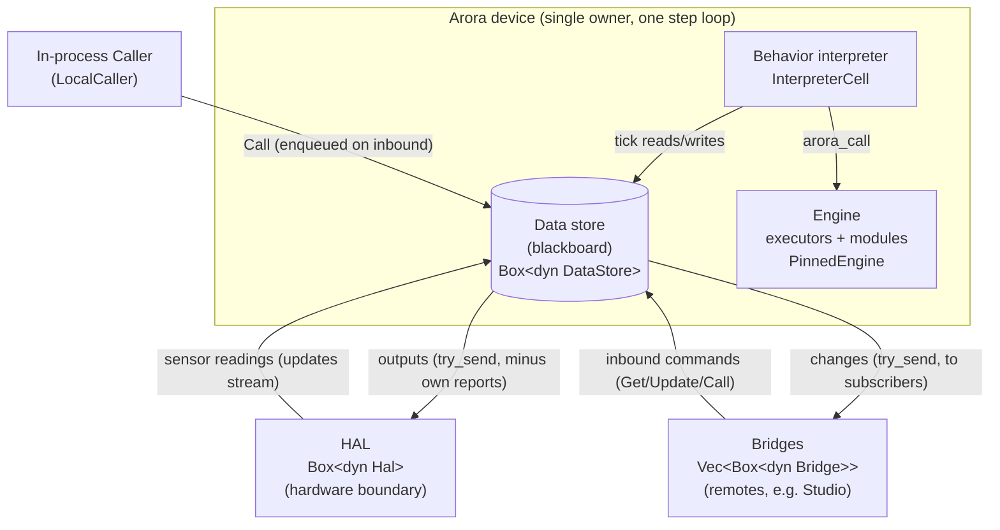

# The Arora runtime — components and the step loop

This page shows how the pieces of an Arora device fit together and how data flows between them, then walks one iteration of the main loop. It is the companion to [how a behavior interpreter works](../../arora-behavior/docs/interpreter-workflow.md); here we zoom out to the whole device. Every box and step links to the code.

An `Arora` device is **one blackboard (the data store) with four swappable seams around it — store, HAL, bridge, behavior — plus the engine underneath**. `Arora` is the single owner of the state ([`lib.rs:73-88`](../src/lib.rs#L73-L88)): several things want to change the blackboard (the bridge, the HAL, the behavior), and rather than share it behind a lock and race, `Arora` serializes them as phases of one `step`. It owns no async runtime and spawns no threads, which is also why it drops unchanged into a Web Worker.

## Components and data flow



Each seam is a `Box<dyn Trait>` the `Arora` device owns by value. The concrete list is the `Arora` struct's fields ([`lib.rs:89-153`](../src/lib.rs#L89-L153)):

| Component | Type | Role | Source |
|---|---|---|---|
| Data store | `Box<dyn DataStore>` | the path-keyed blackboard everything reads/writes; interior-mutable so it can be shared | [`store.rs:94-122`](../../arora-types/src/data/store.rs#L94-L122) |
| HAL | `Box<dyn Hal>` | the hardware boundary: `updates()` feeds sensor readings in, `try_send()` pushes outputs out (must not block) | [`arora-hal/src/lib.rs:80-116`](../../arora-hal/src/lib.rs#L80-L116) |
| Bridges | `Vec<Box<dyn Bridge>>` | remote endpoints (e.g. Semio Studio): `take_inbound()` (once) for commands in, `try_send()` for changes out | [`arora-bridge/src/lib.rs:239-287`](../../arora-bridge/src/lib.rs#L239-L287) |
| Behavior | `InterpreterCell = Rc<RefCell<Option<Box<dyn BehaviorInterpreter>>>>` | the one interpreter ticked each step | [`runtime.rs:353`](../src/runtime.rs#L353) |
| Engine | `PinnedEngine` | executors (wasm/native/browser) + modules; reached via `CallBridge::arora_call` | [`arora-engine/src/engine.rs:83-87`](../../arora-engine/src/engine.rs#L83-L87) |

The behavior interpreter is also registered **on the engine as a module** (well-known `LOAD`/`EDIT` ids), so a remote `Call` can load or edit the running behavior over the same dispatch path any other module call uses ([`lib.rs:461-479`](../src/lib.rs#L461-L479)). See the [interpreter workflow doc](../../arora-behavior/docs/interpreter-workflow.md#4-graph-updates).

### How a value moves through the device

- **Inbound command → store → behavior → out.** A remote (or the in-process [`LocalCaller`](../src/lib.rs#L235)) produces an `Inbound::Command`. All bridge inbound streams and the caller channel are merged into one `inbound` selector at build time ([`lib.rs:421-443`](../src/lib.rs#L421-L443)). The loop buffers arrivals, then a step applies them to the store, ticks the behavior against the updated store, coalesces every write, and fans it out to the HAL and bridges.
- **Sensor reading → store → out.** The HAL's `updates()` stream feeds `pending.sensors`; a step applies them, and on the way out the HAL is *not* told what it just reported (the frame subtracts hardware-originated keys) unless the behavior overwrote them ([`runtime.rs:448-467`](../src/runtime.rs#L448-L467)).
- **Store change → bridges.** Every write during a frame lands in the store; its subscription feeds the flush, and the merged change fans out to each bridge whose endpoint has asked for data ([`runtime.rs:469-475`](../src/runtime.rs#L469-L475)).

## The main loop

The device is driven either by `Arora::run(period)` — a self-pacing loop that `.await`s a metronome tick and the inbound seams between fully-synchronous steps ([`runtime.rs:75-108`](../src/runtime.rs#L75-L108)) — or by calling `Arora::step(dt)` directly (e.g. once per browser animation frame). The default period is 10 ms, ~100 Hz ([`runtime.rs:52`](../src/runtime.rs#L52)). Inbound arrivals are only *buffered* between steps; nothing touches the store outside `step`, and the select is biased toward the tick so an event flood cannot starve the cadence ([`runtime.rs:54-74`](../src/runtime.rs#L54-L74)).

One `step` runs a fixed pipeline of phases ([`Arora::step`, `runtime.rs:501-538`](../src/runtime.rs#L501-L538)):

```mermaid
sequenceDiagram
    autonumber
    participant Loop as run() loop
    participant Step as Arora::step(dt)
    participant Store as Data store
    participant Interp as Interpreter
    participant Engine as Engine
    participant HAL
    participant Bridges

    Loop->>Loop: await metronome tick + buffer HAL/inbound into Pending
    Loop->>Step: step(dt = measured wall-clock delta)

    Step->>Step: 0 sweep_now — drain HAL/inbound (non-blocking)
    Step->>Store: 1a/1b tick_clock + publish_clock (arora/time, arora/dt)
    Step->>Store: 2 apply_sensors (HAL readings, oldest-first)
    Step->>Store: 3 apply_events → apply_command (Get/Update/Call)
    Note over Step,Engine: Call dispatches into the engine (modules, interpreter LOAD/EDIT); reply on the command's channel
    Step->>Interp: 4 tick_behavior — tick the interpreter LAST
    Interp->>Store: read inputs, write intent/outputs
    Interp-->>Step: Running (keep) | Done (drop) | Err (set behavior_error, keep going)
    Step->>Store: 5 flush — coalesce this frame's writes into one StateChange
    Step->>HAL: 6a write_hal (out minus hardware-originated keys)
    Step->>Bridges: 6b write_bridges (to endpoints that asked for data)
```

| Phase | Function | What it does | Source |
|---|---|---|---|
| 0 sweep | `sweep_now` | non-blocking drain of HAL + inbound into `pending` (the whole inbound drain for a direct-`step` driver) | [`runtime.rs:174`](../src/runtime.rs#L174) |
| 1a clock | `tick_clock` | advance the monotonic nanosecond accumulator by `dt` | [`runtime.rs:191`](../src/runtime.rs#L191) |
| 1b publish | `publish_clock` | write golden `arora/time` + `arora/dt` into the store **first**, so the whole frame sees this frame's time | [`runtime.rs:207`](../src/runtime.rs#L207) |
| 2 sensors | `apply_sensors` | apply HAL readings oldest-first; return the coalesced set so phase 6a can subtract them | [`runtime.rs:224`](../src/runtime.rs#L224) |
| 3 events | `apply_events` / `apply_command` | apply bridge/caller events after sensors; `Get`→read, `Update`→write, `Call`→engine, then reply on the command channel | [`runtime.rs:250`](../src/runtime.rs#L250) / [`:282`](../src/runtime.rs#L282) |
| 4 behavior | `tick_behavior` | tick the one interpreter **last** (its writes win); `Done`→drop, `Err`→standing `behavior_error`, device keeps running | [`runtime.rs:391`](../src/runtime.rs#L391) |
| 5 flush | `flush` | drain the store subscription, coalesce into one `StateChange` (later write wins) | [`runtime.rs:427`](../src/runtime.rs#L427) |
| 6a HAL out | `write_hal` | `hal.try_send(out)` minus keys the hardware itself just reported | [`runtime.rs:448`](../src/runtime.rs#L448) |
| 6b bridges out | `write_bridges` | fan the same change to every bridge whose endpoint asked for data | [`runtime.rs:469`](../src/runtime.rs#L469) |

The ordering encodes a per-key precedence — **behavior ▸ bridge ▸ HAL ▸ previous frame**, newest write wins within each tier ([`runtime.rs:486-492`](../src/runtime.rs#L486-L492)). Because the behavior is ticked last, it always sees the freshest clock, sensor, and command values, and its writes are the frame's final word.

## Wiring a device together

Everything is assembled by [`AroraBuilder`](../src/lib.rs#L263-L498) — fluent setters (`with_data_store`, `with_hal`, `with_bridge`, `with_behavior_interpreter`, `with_module`, `with_host_module`) and a `build()` that defaults the store to `SimpleDataStore` and the HAL to `FakeHal`, merges the bridge inbound streams, and registers the interpreter-as-module. The `run_with*` family in [`run.rs`](../src/run.rs) is sugar over the builder, differing only in which seams the caller supplies versus defaults ([`run.rs:1-29`](../src/run.rs#L1-L29)). A device-specific binary is typically just a custom `Hal`/`Bridge` plus one `run_with(...)` call — see [`examples/device.rs`](../examples/device.rs).

## Same loop, native and browser

The loop code is identical on both targets; only the metronome's sleep and the engine's executor host are target-specific ([`runtime.rs:548-595`](../src/runtime.rs#L548-L595)):

- **Native**: a Tokio runtime drives the future; the metronome sleeps on `tokio::time`; the engine hosts wasm via wasmtime + native dylibs.
- **Browser/wasm**: `wasm_bindgen_futures::spawn_local` inside a dedicated Web Worker drives it; the metronome sleeps on `gloo_timers` (JS `setTimeout`); the engine uses the browser `WebAssembly` executor. A dedicated Web Worker is exempt from the background-tab timer throttling that would otherwise slow a hidden page ([`runtime.rs:31-49`](../src/runtime.rs#L31-L49)). For render-coupled stepping, drive `step` from `requestAnimationFrame`.

## Source map

| Concept | File |
|---|---|
| The `Arora` device, builder, seam wiring, interpreter-as-module | [`crates/arora/src/lib.rs`](../src/lib.rs) |
| The step loop, phases, metronome, precedence | [`crates/arora/src/runtime.rs`](../src/runtime.rs) |
| `run` / `run_with*` entry points | [`crates/arora/src/run.rs`](../src/run.rs) |
| HAL trait | [`crates/arora-hal/src/lib.rs`](../../arora-hal/src/lib.rs) |
| Bridge trait, `Inbound`/`BridgeOp` | [`crates/arora-bridge/src/lib.rs`](../../arora-bridge/src/lib.rs) |
| Engine, executors, modules, `CallBridge` | [`crates/arora-engine/src/engine.rs`](../../arora-engine/src/engine.rs) |
| Data store / `Slot` / `StateChange` | [`crates/arora-types/src/data/store.rs`](../../arora-types/src/data/store.rs) |
| Behavior interpreter (the thing ticked in phase 4) | [`crates/arora-behavior/docs/interpreter-workflow.md`](../../arora-behavior/docs/interpreter-workflow.md) |

Tests that exercise the loop end-to-end: `run_paces_steps_at_the_period` ([`runtime.rs:891`](../src/runtime.rs#L891)), `golden_clock_is_published_to_the_store_each_step` ([`runtime.rs:1265`](../src/runtime.rs#L1265)), the outbound fan-out trio ([`runtime.rs:1337-1430`](../src/runtime.rs#L1337-L1430)), `a_failing_behavior_is_state_not_a_stop` ([`lib.rs:615-678`](../src/lib.rs#L615-L678)), and the metronome cadence tests that also run in a headless browser ([`runtime.rs:601-717`](../src/runtime.rs#L601-L717)).
