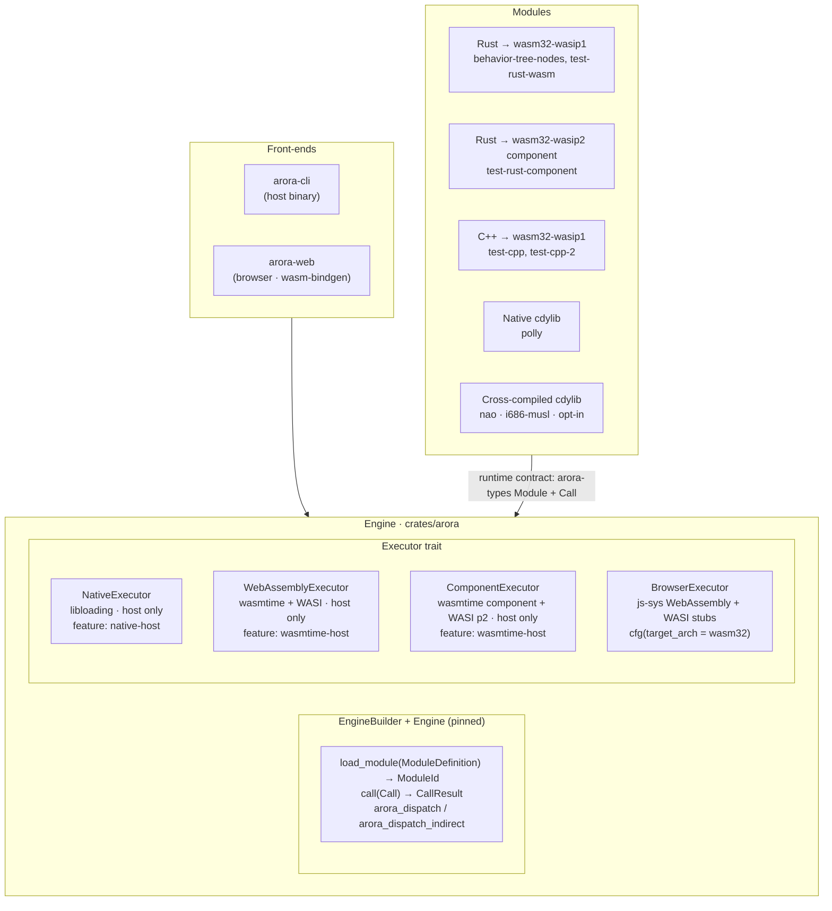
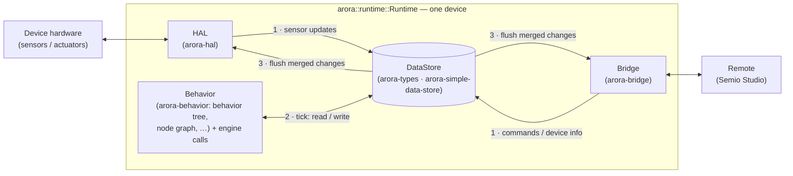

# Architecture

A bird's-eye view of how the repo is laid out and how the pieces fit together.
For the *why* behind these choices, see
[`design_decisions.md`](design_decisions.md).

## Repo layout

```
arora-sdk/
├── crates/
│   ├── arora                  the runtime: a synchronous step loop over four
│   │                          seams (store, HAL, bridge, behavior) + launch API
│   ├── arora-engine           the module engine: executors, dispatch,
│   │                          host-defined modules (ModuleBuilder)
│   ├── arora-types            value / type / record vocabulary, value_serde
│   ├── arora-buffers          wire buffers + serde straight to the wire
│   ├── arora-behavior         BehaviorInterpreter seam, interpreter module
│   │                          ids (load/edit), golden store keys (time/dt)
│   ├── arora-behavior-tree         behavior-tree interpreter
│   ├── arora-behavior-tree-types       BT primitive types
│   ├── arora-behavior-tree-types-yaml  same types serialised as YAML records
│   ├── arora-bridge           Bridge seam + in-process FakeBridge
│   ├── arora-bridge-ws        WebSocket bridge
│   ├── arora-bridge-ros2      ROS 2 bridge
│   ├── arora-hal              HAL seam + FakeHal
│   ├── arora-hal-ros2         ROS 2 HAL
│   ├── arora-hal-restful      RESTful HAL
│   ├── arora-simple-data-store  trivial owned DataStore
│   ├── arora-web              browser runtime: the AroraRuntime JS device
│   │                          over arora + the JS engine surface
│   ├── arora-cli              host CLI: load modules, call functions
│   ├── arora-registry         local record registry
│   ├── arora-registry-remote  remote record registry
│   ├── arora-module-authoring/  module-author toolbox (grouped crates)
│   │   ├── core               type/module analysis + resolution
│   │   ├── cli                host code-generator entry point
│   │   ├── rust               Rust code generator
│   │   └── cpp                C++ code generator
│   ├── arora-buffers, arora-util, arora-vfs, wasi-sdk   support crates
├── modules/              Arora modules (guest code loaded by the engine)
│   ├── test-rust-wasm         Rust → wasm32-wasip1; reference module
│   ├── test-behavior-tree-nodes  test-only module exercising BT dispatch
│   ├── test-rust-component    Rust → wasm32-wasip2 component; arora:module world
│   ├── test-cpp / test-cpp-2  C++ → wasm32-wasip1 via WASI SDK + cmake
│   ├── polly                  host cdylib; AWS Polly TTS nodes
│   ├── transcribe             speech-to-text module
│   └── nao                    cross-built i686-musl cdylib (opt-in)
├── libs/
│   └── cpp/                   shared C++ helpers used by C++ modules
├── tests/                arora-integration-tests crate; end-to-end smoke tests
├── docs/
│   ├── architecture.md        this file
│   ├── design_decisions.md    why things are the way they are
│   └── dispatch.md            direct vs indirect dispatch; how BTs use it
├── examples/
├── wit/                  arora:module WIT world for component guests
├── .cargo/config.toml    unstable flags + i686-musl cross settings
├── rust-toolchain.toml   pins nightly + wasm32-wasip1/p2 + i686-musl
├── Cargo.toml            workspace root
└── .github/workflows/    CI
```


## Layers



## Runtime: store, HAL, bridge, behavior

The `arora` crate wraps the engine in a device runtime built around one
blackboard with four seams. The store is the single shared state; everything
else either feeds it or reads it, serialized as the steps of one loop
(`arora::runtime::Runtime::step`): drain HAL and bridge updates into the
store, tick the behavior against it, flush the merged changes back out to the
remote and the hardware. `step()` is synchronous and non-blocking; the async
bridge/HAL I/O lives in a separate futures-only pump, which is what lets the
same loop run on a native thread or in a browser Web Worker.



Each seam is a trait, so embedders swap implementations without touching the
loop:

- **Store** — `arora_types::data::DataStore`; `SimpleDataStore` is the
  reference implementation. Clones share storage, and `NamespacedStore` gives
  a device-relative view into a shared backend: this is how one process (e.g.
  Semio Studio) spawns many runtimes over one mutualized blackboard, each
  under its own `<device>/` prefix (`Runtime::with_io_in`).
- **HAL** — `arora_hal::Hal`, the device boundary. A robot HAL talks to
  hardware; a simulator or a renderer (e.g. a Vizij rig-instrumented face) is
  just another implementation.
- **Bridge** — `arora_bridge::Bridge`, the remote boundary. The studio-bridge
  Zenoh connector implements it for real devices; an in-process loopback can
  implement it for embedded runtimes.
- **Behavior** — `arora_behavior::Behavior`, the "what to do each step". The
  behavior tree is one interpreter; a Vizij node graph is another.

## Engine

The engine library (`crates/arora-engine`) is dual-target:

- On native (`cfg(not(target_arch = "wasm32"))`), it compiles `executor::native`
  (libloading), `executor::wasm` (wasmtime core modules), and
  `executor::component` (wasmtime component model against
  `wit/arora-module.wit`). All are gated by Cargo features
  (`native-host`, `wasmtime-host`), both default-on.
- On `wasm32-*`, it compiles `executor::browser` instead and accepts
  `--no-default-features` to drop the host-only deps.

`arora::load::*` exposes header-yaml + bytes → `ModuleDefinition` helpers used
by both `arora-cli` (host) and `arora-web` (browser).

`Engine` is pinned (`Pin<Box<Engine>>`) so host callbacks can capture a
stable raw pointer for `arora_dispatch` / `arora_dispatch_indirect` round-trips
through guest wasm.

## Modules

A module is a binary (host cdylib, wasm32-wasip1 .wasm, or cross-compiled
ELF) plus a `module.yaml` header. The header declares:

- **Types**: `Enumeration`s and `Structure`s, identified by UUID.
- **Functions**: each has an id, an args struct id, and a return struct id.

The runtime contract — buffer layout, dispatch ABI, struct serialization —
lives in `arora-types` and `arora-buffers` (both in this workspace, published
to crates.io).

Modules do not have to be binaries. The host can define a module in plain
Rust with `arora_engine::ModuleBuilder`: give it the module's UUID and attach
closures under function UUIDs, and the engine dispatches to it exactly as it
does to guest code — same argument decoding, same result encoding. The
behavior interpreter is exposed this way: `arora-behavior` declares the
interpreter module's ids (`load`, `edit`), and the `arora` runtime builds the
module from the running interpreter, so behaviors are loaded and edited
through ordinary module calls.

Rust types cross these boundaries via serde: `arora_types::value_serde`
converts any `Serialize`/`Deserialize` type to and from an Arora `Value`, and
`arora_buffers::typed` serializes the same types straight to the wire bytes,
skipping the intermediate `Value`. Generated code from `module.yaml` remains
the path for cross-language modules; the serde path serves host-side Rust.

Authors write a `module.yaml` and run `arora-module-cli` to generate the
language-specific scaffold (`arora-module-rust` for Rust, `arora-module-cpp`
for C++) and a stripped "header" form for runtime use. The host-tool
location is delivered to each module's `build.rs` via cargo bindeps.

**Code generation:** Each module's `build.rs` automatically regenerates
`src/arora_generated/` on every build from the `module.yaml` source. Manual
edits to generated files are lost. To modify a module's interface, edit
`module.yaml` (including `imports:` and `dependencies:` for cross-module
calls) and rebuild. See [`../AGENTS.md`](../AGENTS.md) for detailed guidance.

## Build orchestration

`cargo` drives the build. A bare `cargo build` covers the workspace
`default-members` (engine, host tools, host builds of the Rust modules, the
integration-test crate); `cargo build --workspace` additionally builds the
heavier `test-cpp` / `test-cpp-2` / `nao` members, which `default-members`
excludes. Cross-target artefacts are expressed as artifact dependencies
(`-Z bindeps`):

- **Host bins** (e.g. `arora-module-cli`) — `build-dependencies` with
  `artifact = "bin"`. Cargo exports `CARGO_BIN_FILE_<DEP>` (bin target names
  keep their dashes, so this short convenience name is set).
- **Cross-target staticlibs** (`arora-buffers`, `arora-util` for
  `wasm32-wasip1` or `i686-unknown-linux-musl`) — `build-dependencies`
  with `artifact = "staticlib", target = "..."`. Cargo exports
  `CARGO_STATICLIB_DIR_<DEP>` and `CARGO_STATICLIB_FILE_<DEP>_<lib>` (lib
  name, dashes→underscores). The bare `CARGO_STATICLIB_FILE_<DEP>` is **not**
  set for dash-named crates — read the suffixed or `DIR` form. See
  [`design_decisions.md`](design_decisions.md).
- **Cross-target cdylibs** (the Rust wasm guests in
  `arora-integration-tests`) — `artifact = "cdylib", target = "wasm32-wasip1"`;
  exported the same way as `CARGO_CDYLIB_FILE_<DEP>_<lib>`.

For C++ modules, each `build.rs` calls into the module's
self-contained `CMakeLists.txt` via `cmake::Config`, passing the bindep'd
paths as `-D` cache vars and forcing `cmake-rs`'s target via
`.target(...).host(...).no_default_flags(true)`.

The Rust wasm guests (`behavior-tree-nodes`, `test-rust-wasm`) are ordinary
`cdylib`+`rlib` crates built for the host by default — no `forced-target` is
used. Their wasm32-wasip1 build is forced on demand by the `arora-behavior-tree`
and integration-test crates' artifact dependencies (`target = "wasm32-wasip1"`),
so `cargo test` builds the guests itself and the tests find them via forwarded
`CARGO_CDYLIB_FILE_*` env vars (no explicit per-target build step needed).

See [`design_decisions.md`](design_decisions.md#build-orchestration) for the
rationale.

## Browser target

`crates/arora-web` is the JS-facing wasm-bindgen surface. It compiles
`arora` for `wasm32-unknown-unknown` with `--no-default-features` (so no
wasmtime, no libloading) and adds an `Engine` class exposing
`loadModule(headerJson, bytes)` and `call(callJson)` to JS.

The browser executor lives inside `arora` itself
(`crates/arora/src/executor/browser/`). It uses `js_sys::WebAssembly` for
instantiation and ships minimum-viable WASI stubs (proc_exit, fd_write to
console, random_get via crypto.getRandomValues, …) so wasm32-wasip1 guest
modules can be loaded without re-compiling them for `unknown-unknown`.

Demo + headless-Firefox test under `crates/arora-web/www/` and
`crates/arora-web/tests/`.

## Records and the registry

The engine identifies types and functions by UUID. Those UUIDs name **type
records** — versioned declarations of structures, enumerations and modules,
defined in [`arora_types::record`](https://docs.rs/arora-types/latest/arora_types/record/)
and explained in [`docs/records.md`](records.md).

`arora-registry` stores, freezes and resolves records locally (in-process or
from YAML record files). The registries backed by Semio's hosted store live in
the private `arora-registry-remote` crate
([why](design_decisions.md#the-remote-registry-is-a-separate-private-crate)).
The registry is host-only; the browser engine accepts already-resolved headers
from the JS layer.

## Behavior trees

`arora-behavior-tree` ticks behavior trees whose leaves are calls into
Arora module functions. Node primitives live in
`arora-behavior-tree-types` (Rust types) and
`arora-behavior-tree-types-yaml` (YAML records consumable by C++ via
`arora-module-cpp`).

The test-behavior-tree-nodes module (`modules/test-behavior-tree-nodes`) bundles a
baseline collection of nodes as a wasm guest.

The runtime registers each node as a host callable and ticks children through
the engine's **indirect dispatch** path. See [`dispatch.md`](dispatch.md) for
how direct and indirect dispatch work and how behavior trees use them.

## CI

`.github/workflows/continuous.yml`:

- **`build_and_test`** (ubuntu-latest) runs, in order: `cargo build --release`
  (default-members); `cargo test --release` (native + the wasm-via-wasmtime
  integration tests — this builds the wasm32-wasip1 guests via bindeps and
  builds `test-cpp`/`test-cpp-2` via the dev-dependency edge);
  `cargo build -p arora --target wasm32-unknown-unknown --no-default-features
  --release`; then it installs `wasm-pack` and runs the browser test inline
  (`wasm-pack test --headless --firefox --release crates/arora-web`). It also
  frees disk space first (the multi-target builds need ~35 GB).
- **`markdown-link-check`**: link-checks the markdown.

The NAO cross-build is not exercised in CI; it is excluded from
`default-members` and depends on a Homebrew formula not available on the CI
image. Build explicitly with `cargo build -p arora-nao`.
