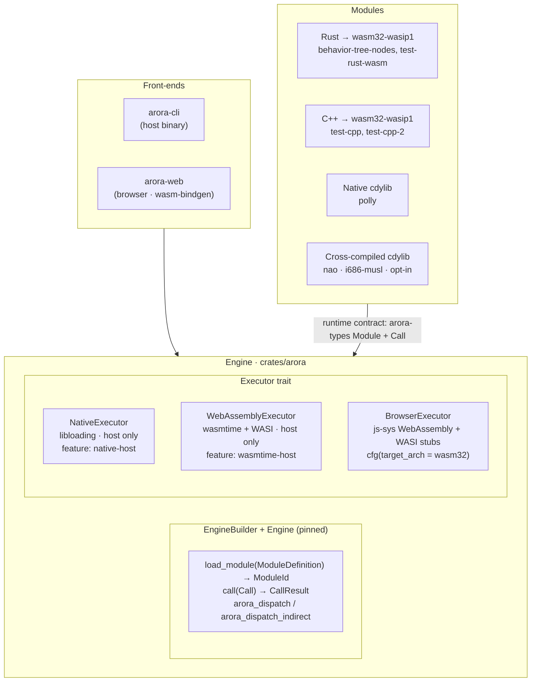

# Architecture

A bird's-eye view of how the repo is laid out and how the pieces fit together.
For the *why* behind these choices, see
[`design_decisions.md`](design_decisions.md).

## Repo layout

```
engine/
├── crates/               Rust crates that make up the engine and tooling
│   ├── arora                  engine library (host + browser dual-target)
│   ├── arora-cli              host CLI: load modules, call functions
│   ├── arora-web              wasm-bindgen JS surface for the engine
│   ├── arora-buffers          buffer impls (Rust, C, C++ headers)
│   ├── arora-util             C-helper utilities written in Rust
│   ├── arora-vfs              virtual filesystem used by code generation
│   ├── arora-registry         local + remote record registry
│   ├── arora-module-core      type/module analysis + resolution
│   ├── arora-module-cli       host code-generator entry point
│   ├── arora-module-rust      Rust code generator
│   ├── arora-module-cpp       C++ code generator
│   ├── arora-behavior-tree         behavior-tree runtime
│   ├── arora-behavior-tree-types         BT primitive types
│   ├── arora-behavior-tree-types-yaml    same types serialised as YAML records
│   └── wasi-sdk               downloads + caches wasi-sdk-33 for build scripts
├── modules/              Arora modules (guest code loaded by the engine)
│   ├── behavior-tree-nodes    Rust → wasm32-wasip1; BT primitives
│   ├── test-rust-wasm         Rust → wasm32-wasip1; reference module
│   ├── test-cpp / test-cpp-2  C++ → wasm32-wasip1 via WASI SDK + cmake
│   ├── polly                  host cdylib; AWS Polly TTS nodes
│   └── nao                    cross-built i686-musl cdylib (opt-in)
├── libs/
│   └── cpp/                   shared C++ helpers used by C++ modules
├── tests/                arora-integration-tests crate; end-to-end smoke tests
├── docs/
│   ├── architecture.md        this file
│   └── design_decisions.md    why things are the way they are
├── examples/
├── .cargo/config.toml    unstable flags + i686-musl cross settings
├── rust-toolchain.toml   pins nightly + wasm32-wasip1 + i686-musl
├── Cargo.toml            workspace root
└── .github/workflows/    CI
```

`transcribe/` is an independent module project not currently in the workspace.

## Layers



## Engine

The engine library (`crates/arora`) is dual-target:

- On native (`cfg(not(target_arch = "wasm32"))`), it compiles `executor::native`
  (libloading) and `executor::wasm` (wasmtime). Both are gated by Cargo
  features (`native-host`, `wasmtime-host`), both default-on.
- On `wasm32-*`, it compiles `executor::browser` instead and accepts
  `--no-default-features` to drop the host-only deps.

`arora::load::*` exposes header-yaml + bytes → `ModuleDefinition` helpers used
by both `arora-cli` (host) and `arora-web` (browser).

`Engine` is pinned (`Pin<Box<Engine>>`) so host callbacks can capture a
stable raw pointer for `arora_dispatch` / `arora_dispatch_indirect` round-trips
through guest wasm.

## Modules

A module is a binary (host cdylib, wasm32-wasip1 .wasm, or cross-compiled
ELF) plus a `module.yaml` header. The header declares:

- **Types**: `Enumeration`s and `Structure`s, identified by UUID.
- **Functions**: each has an id, an args struct id, and a return struct id.

The runtime contract — buffer layout, dispatch ABI, struct serialization —
lives in [`arora-types`](https://github.com/semio-ai/arora-types) (published
to crates.io) and `arora-buffers` (in-tree).

Authors write a `module.yaml` and run `arora-module-cli` to generate the
language-specific scaffold (`arora-module-rust` for Rust, `arora-module-cpp`
for C++) and a stripped "header" form for runtime use. The host-tool
location is delivered to each module's `build.rs` via cargo bindeps.

## Build orchestration

`cargo build --workspace` is the entry point. Cross-target artefacts are
expressed as artifact dependencies (`-Z bindeps`):

- **Host bins** (e.g. `arora-module-cli`) — `build-dependencies` with
  `artifact = "bin"`. Cargo exports `CARGO_BIN_FILE_<DEP>`.
- **Cross-target staticlibs** (`arora-buffers`, `arora-util` for
  `wasm32-wasip1` or `i686-unknown-linux-musl`) — `build-dependencies`
  with `artifact = "staticlib", target = "..."`. Cargo exports
  `CARGO_STATICLIB_FILE_<DEP>` and `CARGO_STATICLIB_DIR_<DEP>`.
- **Cross-target cdylibs** (the Rust wasm guests in
  `arora-integration-tests`) — `artifact = "cdylib", target = "wasm32-wasip1"`.

For C++ modules, each `build.rs` calls into the module's
self-contained `CMakeLists.txt` via `cmake::Config`, passing the bindep'd
paths as `-D` cache vars and forcing `cmake-rs`'s target via
`.target(...).host(...).no_default_flags(true)`.

For wasm-only Rust modules, `forced-target = "wasm32-wasip1"` in
`Cargo.toml` (under `-Zper-package-target`) keeps `cargo build --workspace`
from trying to build them for the host.

See [`design_decisions.md`](design_decisions.md#build-orchestration) for the
rationale.

## Browser target

`crates/arora-web` is the JS-facing wasm-bindgen surface. It compiles
`arora` for `wasm32-unknown-unknown` with `--no-default-features` (so no
wasmtime, no libloading) and adds an `Engine` class exposing
`loadModule(headerJson, bytes)` and `call(callJson)` to JS.

The browser executor lives inside `arora` itself
(`crates/arora/src/executor/browser/`). It uses `js_sys::WebAssembly` for
instantiation and ships minimum-viable WASI stubs (proc_exit, fd_write to
console, random_get via crypto.getRandomValues, …) so wasm32-wasip1 guest
modules can be loaded without re-compiling them for `unknown-unknown`.

Demo + headless-Firefox test under `crates/arora-web/www/` and
`crates/arora-web/tests/`.

## Records and the registry

The engine identifies types and functions by UUID. Records of those types
come from Semio's broader ecosystem:

- [`semio-record`](https://github.com/semio-ai/semio-record) — data structures.
- [`semio-store-rpc`](https://github.com/semio-ai/semio-store-rpc),
  [`semio-client`](https://github.com/semio-ai/semio-client) — RPC to a
  [`semio-db`](https://github.com/semio-ai/semio-db) instance.

`arora-registry` resolves records locally (from files) or remotely (via
semio-client). The registry is host-only; the browser engine accepts
already-resolved headers from the JS layer.

## Behavior trees

`arora-behavior-tree` ticks behavior trees whose leaves are calls into
Arora module functions. Node primitives live in
`arora-behavior-tree-types` (Rust types) and
`arora-behavior-tree-types-yaml` (YAML records consumable by C++ via
`arora-module-cpp`).

The behavior-tree-nodes module (`modules/behavior-tree-nodes`) bundles a
baseline collection of nodes as a wasm guest.

## CI

`.github/workflows/continuous.yml`:

- **`build_and_test`** (ubuntu-latest): builds the workspace `--release`,
  forces the wasm32-wasip1 guests, runs `cargo test --all --release`, and
  builds `arora` for `wasm32-unknown-unknown` `--no-default-features`.
- **`browser_test`** (ubuntu-latest, depends on the above): installs
  geckodriver from its GitHub release (Firefox is preinstalled on
  ubuntu-latest), runs `wasm-pack test --headless --firefox --release
  crates/arora-web`.
- **`markdown-link-check`**: link-checks the markdown.

The NAO cross-build is not exercised in CI; it is excluded from
`default-members` and depends on a Homebrew formula not available on the CI
image. Build explicitly with `cargo build -p arora-nao`.
