# Building Arora

> Preserved from the original root readme before the repo was consolidated into
> the single `arora-sdk` workspace. Some crate names/paths predate the
> consolidation and will be refreshed as the reorg lands; the concepts hold.

## Building

The build is driven by Cargo. The repo is a single workspace pinned to
nightly (`rust-toolchain.toml`) so that the
[`bindeps`](https://doc.rust-lang.org/cargo/reference/unstable.html#artifact-dependencies)
unstable feature is available: cross-target artifacts (wasm guests,
static libs, host code generators) are expressed as artifact
dependencies and resolved by cargo itself. There is no top-level CMake;
C++ modules each carry their own `CMakeLists.txt` invoked from a
`build.rs` via the `cmake` crate.

### Prerequisites

- Rust nightly with the standard toolchain. The pinned `rust-toolchain.toml`
  also requests the `wasm32-wasip1` and `wasm32-wasip2` targets. (The NAO
  cross-build's `i686-unknown-linux-musl` is a linker toolchain, not a rustup
  target — see the NAO prerequisite below.)
- A working C/C++ compiler for the host (Xcode CLT on macOS, gcc/clang on
  Linux).
- For the NAO target (Mac, opt-in): `brew install messense/macos-cross-toolchains/i686-unknown-linux-musl`.
- The WASI SDK is downloaded automatically by `crates/wasi-sdk` into
  `target/wasi-sdk-33/` on first use; no manual install needed.

### Build

```bash
cargo build --workspace
```

This produces:

- Host binaries (`arora-cli`, `arora-module-cli`, `arora-module-cpp`, …)
  under `target/<profile>/`.
- Host cdylibs for native modules (`libpolly.dylib` / `.so`).
- C++ wasm guests (`test-cpp.wasm`, `test-cpp-2.wasm`) staged under
  `target/<profile>/modules/`.
- Rust modules (`test-behavior-tree-nodes`, `test-rust-wasm`) built for the
  **host** by default — `cargo test -p test-rust-wasm` runs natively.
  Their wasm flavour is produced on demand (see *Testing* below).
  (`test-behavior-tree-nodes` is test-only now: the basic control nodes moved
  native into `arora-behavior-tree`.)

The NAO module is opt-in and requires the i686-unknown-linux-musl cross-toolchain:

```bash
cargo build -p arora-nao
```

It cross-compiles to `i686-unknown-linux-musl`, producing
`target/debug/modules/libnao.so` linked against libqi (fetched via CMake
`FetchContent` on first build; expect ~10 min cold).

### Testing

Mirror what CI does (release shown; drop `--release` for a debug run):

```bash
cargo build --release
cargo test --release
```

`cargo test` is self-sufficient: the `arora-integration-tests` crate declares
the wasm guests as artifact dependencies — `test-rust-wasm` and
`test-behavior-tree-nodes` (`wasm32-wasip1`) plus `test-rust-component`
(`wasm32-wasip2`) — so running the tests builds the guests on its own and finds
them through env vars forwarded by its `build.rs` (`CARGO_CDYLIB_FILE_*`). No
separate `cargo build --target wasm32-wasip1` is needed. The `test-cpp` /
`test-cpp-2` wasm (plus their `module.yaml` / `records/`) are published by those
modules' `build.rs` under `target/<profile>/modules/` and read by path.

Both integration tests run green from a clean build:
`call_test_rust_wasm_from_engine` and the C++-into-wasm
`call_test_cpp_2_from_engine_with_struct` (multi-module `--call`). Neither is
`#[ignore]`d — the earlier arora-cli tokio-runtime issue on multi-module calls
was fixed by reusing the caller's runtime.

### Browser target

The engine also builds for `wasm32-unknown-unknown`. The `arora-web`
crate is the JS-facing wrapper; it hosts guest modules through the
browser's native `WebAssembly` runtime (no wasmtime).

```bash
wasm-pack build --target web --dev crates/arora-web
GECKODRIVER=$(which geckodriver) wasm-pack test --headless --firefox crates/arora-web
crates/arora-web/www/serve.sh    # demo page on :8080
```

> `wasm-pack test` requires flags **before** the crate path.
>
> On Apple Silicon, the `geckodriver` wasm-pack auto-downloads is
> x86_64-only and SIGABRTs under Rosetta. Install a native arm64
> build (`brew install geckodriver`) and point at it via the
> `GECKODRIVER` env var. The same applies to `--chrome` /
> `chromedriver`.

See [`crates/arora-web/readme.md`](../crates/arora-web/readme.md) for
details.

### Dependency overview

```mermaid
flowchart TD
  subgraph host_bins [Host binaries]
    cli[arora-cli]
    mcli[arora-module-cli]
    mcpp[arora-module-cpp]
    mrust[arora-module-rust]
  end

  subgraph host_libs [Host libraries]
    arora[arora engine]
    bt[arora-behavior-tree]
    registry[arora-registry]
    vfs[arora-vfs]
    buffers[arora-buffers]
    util[arora-util]
    bttypes[arora-behavior-tree-types]
    bttypes_yaml[arora-behavior-tree-types-yaml]
    mcore[arora-module-core]
    wasi[wasi-sdk fetcher]
  end

  subgraph host_modules [Host modules cdylib]
    polly[polly libpolly]
  end

  subgraph nao_module [NAO module - opt-in]
    nao[arora-nao libnao.so i686-musl]
  end

  subgraph wasm_guests [wasm guests wasip1 and wasip2]
    tcpp[test-cpp.wasm]
    tcpp2[test-cpp-2.wasm]
    btn[test-behavior-tree-nodes]
    trw[test-rust-wasm]
    trc["test-rust-component (wasip2)"]
  end

  subgraph tests [arora-integration-tests]
    itest[cargo test]
  end

  cli --> arora
  cli --> buffers
  cli --> mcore
  cli --> registry
  arora --> buffers
  arora --> bttypes
  bt --> arora
  bt --> bttypes
  bt --> registry

  mcli --> mcore
  mcpp --> mcore
  mrust --> mcore
  mrust --> vfs
  mcore --> bttypes
  mcore --> registry

  btn -->|build.rs| mrust
  trw -->|build.rs| mrust
  polly -->|build.rs| mrust
  btn --> buffers
  trw --> buffers
  polly --> buffers

  tcpp -->|bindep bin| mcli
  tcpp -->|bindep bin| mcpp
  tcpp -->|bindep staticlib wasm| buffers
  tcpp -->|bindep staticlib wasm| util
  tcpp -->|build.rs| wasi
  tcpp2 -->|bindep bin| mcli
  tcpp2 -->|bindep bin| mcpp
  tcpp2 -->|bindep staticlib wasm| buffers
  tcpp2 -->|bindep staticlib wasm| util
  tcpp2 -->|build.rs| wasi
  tcpp2 -->|records before| tcpp

  nao -->|bindep bin| mcli
  nao -->|bindep bin| mcpp
  nao -->|bindep staticlib i686-musl| buffers
  nao -->|bindep staticlib i686-musl| util
  nao --> qistub

  itest -->|bindep bin| cli
  itest -->|bindep cdylib wasm| btn
  itest -->|bindep cdylib wasm| trw
  itest -->|bindep cdylib wasm-p2| trc
  itest -->|dev-dep, build.rs publishes| tcpp
  itest -->|dev-dep, build.rs publishes| tcpp2
  itest -.->|runtime lookup target/modules| tcpp
  itest -.->|runtime lookup target/modules| tcpp2
  itest -.->|runtime lookup target/modules| polly
```



Solid arrows are `cargo` dependency edges (regular, build-, or
artifact-dependencies); dotted arrows are runtime lookups that rely on a
prior build. Bindeps surface paths to the consumer's `build.rs` as
environment variables, so each consumer can splice the cross-built artefact
into its own cmake / linker invocation without a recursive cargo call. **The
names have a sharp edge:** for host **bins** the short `CARGO_BIN_FILE_<DEP>`
works (bin names keep dashes), but for **staticlib/cdylib** crates with a
dashed name cargo only sets `CARGO_<KIND>_FILE_<DEP>_<lib>` (lib name,
dashes→underscores, e.g. `CARGO_STATICLIB_FILE_ARORA_BUFFERS_arora_buffers`)
and `CARGO_<KIND>_DIR_<DEP>` — *not* the bare `CARGO_<KIND>_FILE_<DEP>`. Read
the suffixed or `DIR` form (see `modules/test-cpp/build.rs`).

What the integration test crate actually declares as artifact dependencies
(bindeps):

- **`arora-cli`** as `artifact = "bin"` — `tests/build.rs` forwards its path as
  `ARORA_CLI_BIN`.
- **`test-rust-wasm`** as `artifact = "cdylib", target = "wasm32-wasip1"` —
  forces a wasm32-wasip1 build and exposes its `.wasm` as
  `CARGO_CDYLIB_FILE_TEST_RUST_WASM_test_rust_wasm`; the
  `call_test_rust_wasm_from_engine` test loads it.
- **`test-rust-component`** as `artifact = "cdylib", target = "wasm32-wasip2"` —
  a wasip2 **component** guest.
- **`test-behavior-tree-nodes`** as `artifact = "cdylib", target = "wasm32-wasip1"` —
  built so `cargo fmt --check` / clippy have its generated sources and the
  artifact is available; the control nodes it once shipped are now native in
  `arora-behavior-tree`, so nothing in the default build depends on it at
  runtime.
- **`test-cpp`** and **`test-cpp-2`** are plain **dev-dependencies** (not
  bindeps): listing them makes `cargo test` run their `build.rs`, which builds
  the wasm via cmake and publishes `*.wasm` / `module.yaml` / `records/` under
  `target/<profile>/modules/`. The C++ integration test reads those published
  files by path. (They are excluded from `default-members`, so a bare
  `cargo build` does not build them — `cargo test` does.) `polly` is not a
  dependency of this crate — it is a workspace member built in its own right and
  staged under `target/<profile>/modules/`.

### Build flags & options

- `cargo build -p arora-nao` — builds the NAO cross-compile (opt-in; requires
  i686-unknown-linux-musl toolchain). NAO is excluded from `default-members`,
  so `cargo build --workspace` skips it.
- `cargo build --release` for an optimized build; the release profile
  pins `lto = "thin"` and `debug = 1`.

The individual C++ modules' `CMakeLists.txt` files remain invokable
standalone with `-D` overrides, mainly for IDE integration; the
authoritative entry point is `cargo`.
