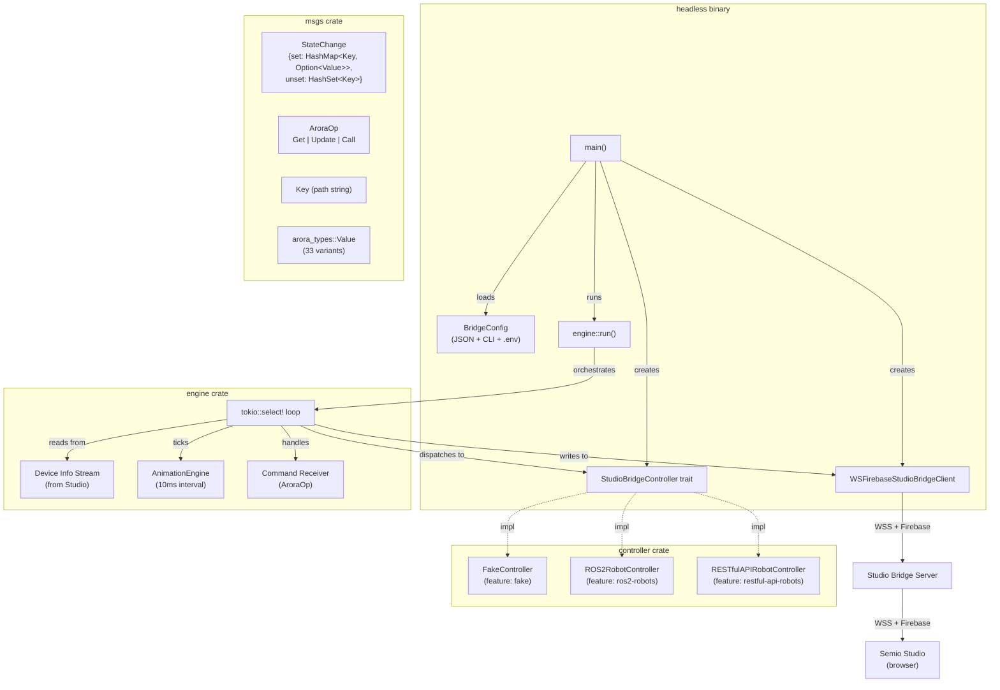
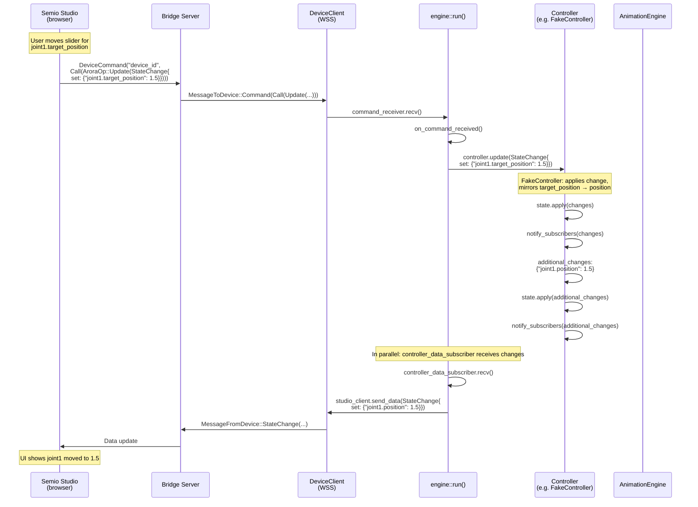
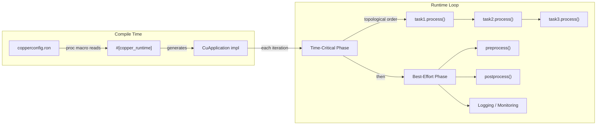

# Copper-rs Study for Semio Arora

## 1. Current Headless / Engine Architecture

### Overview

The `headless` binary is the main deployable artifact of the Arora engine in this repo.
It compiles a set of crates together via **feature flags** to produce a single binary that
connects to Semio Studio via a WebSocket bridge server, exposing a device controller.

### Crate Composition

```text
headless (binary)
  ├── studio-bridge-engine       (lib: main loop orchestrating everything)
  │     ├── studio-bridge-controller  (trait: StudioBridgeController)
  │     │     ├── FakeController       (feature "fake")
  │     │     └── [controller implementations selected at compile time]
  │     ├── studio-bridge-device-client (trait: DeviceClient)
  │     │     └── WSFirebaseStudioBridgeClient (WebSocket + Firebase)
  │     ├── studio-bridge-msgs   (Key, Value, StateChange, AroraOp, etc.)
  │     │     └── arora-types    (Value enum, Call/CallResult, module definitions)
  │     └── animation-player     (AnimationEngine: keyframe interpolation)
  ├── studio-bridge-ros2-robots  (feature "ros2-robots": ROS2 controller impl)
  ├── studio-bridge-restful-api-robots (feature "restful-api-robots")
  ├── firestore-stream           (Firebase Firestore client)
  └── [CLI: clap, logging: log4rs/env_logger, crypto, etc.]
```

### Feature Flag Selection

The `headless/Cargo.toml` uses feature flags to select a controller at compile time:

| Feature | Controller | Notes |
|---------|-----------|-------|
| `fake` (default) | `FakeController` | In-memory, mirrors `target_position` → `position` |
| `quori` | `ROS2RobotController` | Quori robot via ROS 2 |
| `ur3` / `ur5` | `ROS2RobotController` | Universal Robots arms |
| `nao-ros2` | `ROS2RobotController` | NAO robot via ROS 2 |
| `pepper-ros2` | `ROS2RobotController` | Pepper robot via ROS 2 |
| `hackerbot` | `RESTfulAPIRobotController` | Hackerbot via REST API |

Only one controller feature should be active. The `headless.rs` main function uses
`#[cfg(feature = "...")]` blocks to instantiate the chosen controller.

### Component Diagram



### Data Flow: Target Joint Position Cycle

The core data path when Studio sends a target joint position to a device:



### Animation Playback Flow

When an animation is playing, the engine ticks the `AnimationEngine` every 10ms:

```mermaid
sequenceDiagram
    participant Studio as Semio Studio
    participant Engine as engine::run()
    participant AnimEng as AnimationEngine
    participant Ctrl as Controller

    Studio->>Engine: Command: Call(AroraCall)<br/>e.g. play animation

    loop Every 10ms (animation_update_interval)
        Engine->>AnimEng: animation_engine.update(delta_t)
        AnimEng-->>Engine: updated_values_by_player:<br/>HashMap&lt;String, AnimationValue&gt;

        Engine->>Engine: Convert AnimationValue::Float → Value::F64<br/>Build StateChange

        alt StateChange not empty
            Engine->>Ctrl: controller.update(state_change)
            Ctrl->>Ctrl: Apply + notify subscribers
            Engine->>Engine: Forward changes to Studio
        end
    end
```

### Key Observations

1. **Static composition**: Controller selection is compile-time via feature flags. No dynamic dispatch for the controller type itself.
2. **Single async loop**: The engine is one big `tokio::select!` loop handling all events.
3. **Pub/sub within process**: The controller's subscriber pattern (`mpsc::Receiver<StateChange>`) handles data flow from controller → engine → Studio.
4. **Key-value state**: All data flows as `StateChange` diffs over `HashMap<Key, Option<Value>>`.
5. **No DAG execution**: There's no pipeline/graph of processing tasks — just engine ↔ controller ↔ Studio.

---

## 2. The Former Arora Engine (`semio-ai/engine`)

> ⚠️ The `semio-ai/engine` repo is **private** (returns 404). This summary is based on
> the public `arora-types` repo and the local `studio-bridge/engine` crate that references it.

### Architecture (from `arora-types`)

The former Arora engine was a **dynamic module runtime** that could load and compose
modules at runtime. Its type system is defined in
[arora-types](https://github.com/semio-ai/arora-types/):

```text
arora-types
  ├── value.rs     → Value enum (33 variants: Unit, Bool, i8-i64, u8-u64, f32/f64,
  │                   String, Structure, Enum, arrays, Option, etc.)
  ├── call.rs      → Call { module_id, id (function), args } → CallResult { ret, mutated }
  ├── ty/          → Two-level type system:
  │     ├── high.rs  → Human-readable (names as strings)
  │     └── low.rs   → UUID-based (portable, stable)
  └── module/      → Module definitions:
        ├── high.rs  → ModuleDefinition { id, name, author, executor, exports, imports }
        └── low.rs   → Header + ModuleDefinition { header, executable: Box<[u8]> }
```

### Key Concepts

**Modules** are self-describing, serializable bundles:

```yaml
# module.yaml (high-level)
id: "550e8400-e29b-41d4-a716-446655440000"
name: "behavior-tree-module"
author: "Semio AI"
executor:
  name: "WebAssembly"
exports:
  - { name: "tick", type_signature: ... }
imports:
  - { name: "get_sensor_data", module_name: "sensor-module", type_signature: ... }
executable_mime: "application/wasm"
```

**Executor types**: WebAssembly, Python, JavaScript, native dynamic libraries.

**Loading flow**:
1. Module's `Header` (low-level, UUID-based) describes its exports and imports
2. Engine resolves import dependencies against loaded modules
3. The `executable: Box<[u8]>` is loaded by the appropriate executor (WASM runtime, dlopen, etc.)
4. Calls dispatch via `Call { module_id, function_id, args }` → `CallResult { ret, mutated }`

**Behavior tree module**: The `arora-registry` contains `Status` and `TickId` type entries,
suggesting a behavior tree protocol existed. The BT module likely:
- Exported a `tick()` function returning `Status` (Success/Failure/Running)
- Imported functions from other modules to query sensor data and send commands
- Could be loaded as a WASM module for sandboxed execution

### Comparison with Current Architecture

| Aspect | Former Engine | Current `studio-bridge` |
|--------|--------------|------------------------|
| Module loading | Dynamic (WASM, dlopen, Python) | Static (feature flags at compile time) |
| Module interface | Serializable `Header` with typed imports/exports | Rust trait (`StudioBridgeController`) |
| Composition | Runtime via `Call` dispatch | Compile-time via `#[cfg(feature)]` |
| Type system | UUID-based two-level types | Direct `arora_types::Value` |
| Behavior trees | Likely a loadable module | Not present |
| Complexity | High (multiple executors, dependency resolution) | Low (single controller, direct calls) |

---

## 3. Copper-rs: Core Architecture

### Overview

[Copper](https://github.com/copper-project/copper-rs) (v0.15.0) is a Rust-first robotics
framework that acts as **"a game engine for robots."** It provides:

- **Sub-microsecond latency**: zero-alloc, cache-friendly data-oriented runtime
- **Deterministic replay**: bit-for-bit identical re-execution
- **Compile-time DAG**: task graph declared in RON, runtime generated by proc macro
- **ROS 2 interop**: bidirectional bridges via Zenoh
- **WASM support**: same code runs on RPi, STM32, and in the browser

### Task Graph

The core abstraction is a **Directed Acyclic Graph (DAG)** of tasks declared in a
`copperconfig.ron` file:

```ron
(
    tasks: [
        (id: "sensor",    type: "sensors::IMU"),
        (id: "filter",    type: "filters::AHRS"),
        (id: "pid",       type: "cu_pid::GenericPIDTask"),
        (id: "actuator",  type: "actuators::Motor"),
    ],
    cnx: [
        (src: "sensor",  dst: "filter",   msg: "sensors::IMUPayload"),
        (src: "filter",  dst: "pid",      msg: "filters::AttitudePayload"),
        (src: "pid",     dst: "actuator", msg: "cu_pid::PIDControlOutputPayload"),
    ],
)
```

The `#[copper_runtime(config = "copperconfig.ron")]` proc macro reads this at compile time
and generates the runtime loop that calls tasks in topological order.

### Task Traits

Three task types form the building blocks:

```rust
/// Source task: produces data (e.g., from a sensor or timer)
pub trait CuSrcTask: Freezable {
    type Output;
    fn new(config: Option<&ComponentConfig>) -> CuResult<Self>;
    fn process(&mut self, ctx: &CuContext, output: &mut Self::Output) -> CuResult<()>;
}

/// Processing task: transforms input to output
pub trait CuTask: Freezable {
    type Input;
    type Output;
    fn new(config: Option<&ComponentConfig>) -> CuResult<Self>;
    fn process(&mut self, ctx: &CuContext, input: &Self::Input, output: &mut Self::Output) -> CuResult<()>;
}

/// Sink task: consumes data (e.g., writes to hardware)
pub trait CuSinkTask: Freezable {
    type Input;
    fn new(config: Option<&ComponentConfig>) -> CuResult<Self>;
    fn process(&mut self, ctx: &CuContext, input: &Self::Input) -> CuResult<()>;
}
```

Each task also has lifecycle methods: `start()`, `stop()`, `preprocess()`, `postprocess()`.

### CopperList

The **CopperList** is Copper's zero-copy message passing mechanism:
- Pre-allocated buffers for all inter-task messages
- Generated at compile time based on the connection graph
- Each slot is typed according to the `msg` field in the RON config
- Supports parallel execution (v0.15) and async I/O offloading

### Execution Model



### Freeze/Thaw (State Serialization)

Every task implements `Freezable`:

```rust
pub trait Freezable {
    fn freeze<E: Encoder>(&self, encoder: &mut E) -> Result<(), EncodeError> {
        Encode::encode(&(), encoder) // default: stateless
    }
    fn thaw<D: Decoder>(&mut self, decoder: &mut D) -> Result<(), DecodeError> {
        Ok(())
    }
}
```

This enables **deterministic replay**: the runtime periodically snapshots all task states
(keyframes), and the unified log stores both CopperLists (data) and task states.

---

## 4. Sub-Studies

The following sub-studies address each specific question from the issue.
Each is a separate document for focused analysis:

1. [**wasm_and_browser_simulation.md**](wasm_and_browser_simulation.md) — WASM support, browser simulation, Bevy/ThreeJS
2. [**behavior_tree_integration.md**](behavior_tree_integration.md) — BT integration with Copper, `bonsai` crate, dynamic loading
3. [**ros2_and_isaac_lab.md**](ros2_and_isaac_lab.md) — ROS 2 Control support, Isaac Lab bridge
4. [**zenoh_overhead.md**](zenoh_overhead.md) — Zenoh + Copper overhead analysis
5. [**gui_and_display.md**](gui_and_display.md) — GUI output, portable display, browser reuse
6. [**dynamic_loading.md**](dynamic_loading.md) — Dynamic module loading, hot-swapping
7. [**overall_recommendation.md**](overall_recommendation.md) — Is Copper worth it for this project?

---

## 5. Quick Reference: Copper vs Current Architecture

| Aspect | Current Arora | Copper |
|--------|--------------|--------|
| **Task composition** | Single `StudioBridgeController` trait | DAG of `CuSrcTask` / `CuTask` / `CuSinkTask` |
| **Configuration** | Feature flags + JSON config files | RON file + `#[copper_runtime]` proc macro |
| **Message passing** | `mpsc::channel<StateChange>` | Zero-alloc CopperList (typed, pre-allocated) |
| **Data model** | `HashMap<Key, Option<Value>>` (33 variants) | Strongly-typed per-connection messages |
| **Execution** | Single `tokio::select!` async loop | Deterministic topological-order loop |
| **Replay** | Not supported | Bit-for-bit deterministic replay |
| **WASM** | `studio-client` compiles to WASM | Full runtime runs in browser via Bevy |
| **ROS 2** | Direct `ros2_client` crate | Zenoh bridge (`cu_ros2_bridge`) |
| **Dynamic loading** | Former engine supported it | Not supported (compile-time only) |
| **Animation** | Built-in `AnimationEngine` | Would be a custom `CuTask` |
| **Latency** | Async, non-deterministic timing | Sub-microsecond, zero-alloc critical path |
