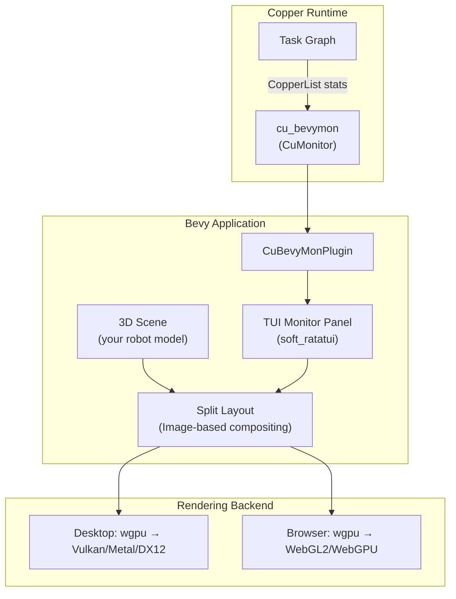

# GUI and Portable Display Output

> Sub-study of [copper_study.md](copper_study.md) — §4.5 "GUI and display".

## Question

What if I want to display something on the screen using Copper? Can I use a GUI?
How would you recommend I do that in a portable way so that the screen output
can be reused in the browser?

---

## Findings

### 1. Copper's Built-in Display Options

Copper provides **four monitor types** for visualizing runtime state:

| Monitor | Technology | Platform | Browser | Notes |
|---------|-----------|----------|---------|-------|
| `cu_consolemon` | Terminal TUI (ratatui) | Linux, macOS, Windows | ❌ | Default monitor, text-based |
| `cu_bevymon` | Bevy (3D engine) | Linux, macOS, Windows | ✅ WASM | Split-view: sim + TUI overlay |
| `cu_logmon` | Logging | Everywhere | ✅ | For firmware / bare-metal |
| `cu_safetymon` | Safety monitoring | Linux | ❌ | Watchdog / safety-critical |

Additionally:
- `cu29_logviz` — Post-hoc log visualization via [Rerun](https://rerun.io/) SDK
- `cu29_rendercfg` — SVG renderer for DAG visualization

### 2. CuBevyMon: The Portable GUI Solution

`cu_bevymon` is the recommended GUI monitor for portable (desktop + browser) display.

**Grounding** — from `components/monitors/cu_bevymon/README.md`:

```markdown
cu_bevymon renders the shared TUI monitor UI inside a Bevy application using the
soft_ratatui backend. It provides:
- CuBevyMon monitor implementation
- CuBevyMonPlugin for Bevy integration
- Split-layout support for combining simulation scenes with monitoring

Font: JetBrains Mono Nerd Font, 24px default, bundled.
```

**How it works**: Bevy renders the 3D scene to an offscreen texture, `cu_bevymon` renders
the TUI monitor to another texture using `soft_ratatui`, and both are composited in a
split-panel layout. The same code works on desktop (native wgpu) and browser (WebGL2/WebGPU).

### 3. Bevy as the Portable Rendering Layer

Bevy (v0.18) is the engine that makes GUI portable across desktop and browser:



### 4. Recipe: Adding a GUI to the Arora Engine with Copper

#### Step 1: Cargo.toml

```toml
[package]
name = "arora-copper-gui"
version = "0.1.0"
edition = "2024"

[dependencies]
cu29 = "0.15"
bevy = "0.18"
cu_bevymon = "0.15"
avian3d = { version = "0.6", optional = true }

[features]
default = ["physics"]
physics = ["dep:avian3d"]

[target.'cfg(target_arch = "wasm32")'.dependencies]
cu29 = { version = "0.15", features = ["wasm"] }
```

#### Step 2: Main application with split-view

```rust
use cu29::prelude::*;
use bevy::prelude::*;
use cu_bevymon::prelude::*;

#[copper_runtime(config = "copperconfig.ron")]
struct App {}

fn main() {
    // --- Copper setup ---
    let logger_path = /* ... */;
    let mut copper_app = App::builder()
        .with_log_path(&logger_path, Some(10 * 1024 * 1024))
        .expect("Failed to setup logger")
        .build()
        .expect("Failed to create Copper app");

    // --- Bevy setup with split layout ---
    bevy::app::App::new()
        .add_plugins(DefaultPlugins)
        .add_plugins(CuBevyMonPlugin::new(copper_app))
        .add_systems(Startup, setup_robot_scene)
        .run();
}

fn setup_robot_scene(
    mut commands: Commands,
    mut meshes: ResMut<Assets<Mesh>>,
    mut materials: ResMut<Assets<StandardMaterial>>,
) {
    // Add your robot 3D model here
    commands.spawn((
        Mesh3d(meshes.add(Cuboid::new(0.5, 1.0, 0.5))),
        MeshMaterial3d(materials.add(Color::srgb(0.3, 0.5, 1.0))),
        Transform::from_xyz(0.0, 0.5, 0.0),
    ));

    // Camera
    commands.spawn((
        Camera3d::default(),
        Transform::from_xyz(3.0, 3.0, 3.0).looking_at(Vec3::ZERO, Vec3::Y),
    ));

    // Light
    commands.spawn((
        DirectionalLight::default(),
        Transform::from_rotation(Quat::from_euler(EulerRot::XYZ, -0.5, 0.5, 0.0)),
    ));
}
```

#### Step 3: Build for browser

```bash
# Install trunk
cargo install trunk

# Create index.html for trunk
cat > index.html << 'EOF'
<!DOCTYPE html>
<html>
<head><meta charset="utf-8"><title>Arora Copper GUI</title></head>
<body style="margin: 0; padding: 0;"></body>
</html>
EOF

# Serve locally with hot-reload
trunk serve --open

# Build for deployment
trunk build --release
# → dist/ folder with WASM + HTML + JS
```

### 5. Custom Visualization via CuSinkTask

For custom display beyond the TUI monitor, create a sink task that updates Bevy entities:

```rust
/// A sink task that updates Bevy entity transforms from Copper data
#[derive(Reflect)]
pub struct RobotVisualizerSink {
    /// Channel to send updates to Bevy
    tx: Option<crossbeam_channel::Sender<JointUpdate>>,
}

impl CuSinkTask for RobotVisualizerSink {
    type Input = input_msg!(JointState);

    fn new(config: Option<&ComponentConfig>) -> CuResult<Self> {
        Ok(Self { tx: None })
    }

    fn process(&mut self, _ctx: &CuContext, input: &Self::Input) -> CuResult<()> {
        if let (Some(tx), Some(state)) = (&self.tx, input.payload()) {
            let _ = tx.try_send(JointUpdate {
                positions: state.positions.clone(),
            });
        }
        Ok(())
    }
}

// Bevy system that reads from the channel
fn update_robot_transforms(
    rx: Res<JointUpdateReceiver>,
    mut query: Query<(&JointIndex, &mut Transform)>,
) {
    if let Ok(update) = rx.0.try_recv() {
        for (joint_idx, mut transform) in query.iter_mut() {
            if let Some(&angle) = update.positions.get(joint_idx.0) {
                transform.rotation = Quat::from_rotation_z(angle as f32);
            }
        }
    }
}
```

### 6. Alternative: Zenoh → Studio (Existing Browser GUI)

If you already have Semio Studio running in the browser, you could skip
Copper's Bevy GUI entirely and continue using Studio as the display layer:

```text
Copper Task Graph ──► cu_zenoh_bridge ──► Zenoh ──► Studio Bridge Server ──► Studio (React/TS)
```

This leverages the existing Studio infrastructure for:
- 3D robot visualization (existing GLB model support)
- Joint state display
- Animation playback controls
- Device management

The Copper GUI (Bevy) would be useful for:
- Standalone operation without Studio
- On-robot display (e.g., touchscreen)
- Development/debugging (monitor + sim in one window)
- Browser-based digital twin (same code as desktop)

### 7. Comparison

| Approach | Desktop | Browser | Existing infra | Effort |
|----------|---------|---------|---------------|--------|
| **cu_bevymon** (Copper native) | ✅ | ✅ WASM | None | Medium — new Bevy code |
| **Zenoh → Studio** | ✅ (Tauri) | ✅ (React) | Yes — existing Studio | Low — reuse existing |
| **Custom Bevy scene** | ✅ | ✅ WASM | None | High — full 3D from scratch |
| **cu29_logviz** (Rerun) | ✅ | ❌ | None | Low — post-hoc only |

---

## Summary

| Question | Answer |
|----------|--------|
| Can Copper display GUI? | **Yes** — `cu_bevymon` provides a Bevy-based monitor |
| Is it portable to browser? | **Yes** — Bevy compiles to WASM via Trunk |
| Best approach for Arora? | **Dual**: `cu_bevymon` for standalone, Zenoh → Studio for existing workflow |
| ThreeJS? | **No** — not supported. Bevy (wgpu) is the rendering stack |
| Custom 3D? | Create a `CuSinkTask` + Bevy system with crossbeam channel |
