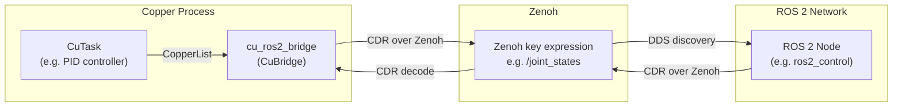

# ROS 2 Control and Isaac Lab

> Sub-study of [copper_study.md](copper_study.md) — §4.3 "ROS 2 and Isaac Lab".

## Questions

1. Are there well-known ways to support ROS 2 Control enabled robots?
2. Is there any bridge with Isaac Lab?
3. If I want to run thousands of instances in Isaac Lab, should I do anything about my use of Copper?

---

## Findings

### 1. ROS 2 Support via Zenoh Bridge — Confirmed

Copper provides a **bidirectional ROS 2 bridge** (`cu_ros2_bridge`) that communicates
with ROS 2 nodes via Zenoh's DDS compatibility layer.

**Grounding** — from `components/bridges/cu_ros2_bridge/README.md`:

```markdown
## Cu ROS 2 Bridge

Enables seamless, bidirectional communication between Copper tasks and ROS 2.
Messages are serialized using CDR (Common Data Representation) and transported over Zenoh.
```

#### How it works



#### Configuration

From `examples/cu_ros2_bridge_demo/copperconfig.ron`:

```ron
(
    tasks: [
        (id: "source", type: "tasks::ExampleSrc"),
        (id: "verifier", type: "tasks::RxVerifier"),
    ],
    bridges: [
        (
            id: "ros2", type: "bridges::ExampleRos2Bridge",
            config: {
                "domain_id": 0,
                "namespace": "copper",
                "node": "bridge_tester"
            },
            channels: [
                Tx(id: "outgoing", route: "/loopback"),
                Rx(id: "incoming", route: "/loopback"),
            ],
        ),
    ],
    cnx: [
        (src: "source", dst: "ros2/outgoing", msg: "i8"),
        (src: "ros2/incoming", dst: "verifier", msg: "i8"),
    ],
)
```

#### Defining a Bridge in Rust

```rust
use cu_ros2_bridge::Ros2Bridge;

// Declare typed channels
tx_channels! {
    pub struct JointTx : JointTxId {
        joint_command => JointCommand = "/joint_group_position_controller/command"
    }
}

rx_channels! {
    pub struct JointRx : JointRxId {
        joint_state => JointState = "/joint_states"
    }
}

pub type RobotRos2Bridge = Ros2Bridge<JointTx, JointRx>;
```

#### Custom Payload Types

The bridge has a **payload codec registry** for ROS 2 message types:

```rust
use cu_ros2_bridge::RosBridgeAdapter;

#[derive(Debug, Default, Clone, Serialize, Deserialize, Reflect)]
pub struct JointState {
    pub name: Vec<String>,
    pub position: Vec<f64>,
    pub velocity: Vec<f64>,
    pub effort: Vec<f64>,
}

impl RosBridgeAdapter for JointState {
    fn namespace() -> &'static str { "sensor_msgs" }
    fn type_name() -> &'static str { "JointState" }
    fn type_hash() -> &'static str { "..." }
    fn to_ros_message(&self, writer: &mut impl Write) { /* CDR encode */ }
    fn from_ros_message(reader: &mut impl Read) -> Self { /* CDR decode */ }
}

// Register at startup:
register_ros2_payload::<JointState>();
```

Primitive types (`bool`, `i8`–`i64`, `u8`–`u64`, `f32`, `f64`, `String`) are auto-registered.

#### ROS 2 Control Integration Pattern

For a `ros2_control`-enabled robot, the Copper DAG would look like:

```ron
(
    tasks: [
        // Copper-side control
        (id: "bt",   type: "cu_behavior_tree::BehaviorTreeTask"),
        (id: "ik",   type: "tasks::InverseKinematics"),
        (id: "ctrl", type: "cu_pid::GenericPIDTask",
         config: {"kp": 10.0, "kd": 1.0, "ki": 0.01, "setpoint": 0.0, "cutoff": 50.0}),
    ],
    bridges: [
        (
            id: "ros2", type: "bridges::RobotRos2Bridge",
            config: {"domain_id": 0, "namespace": "robot", "node": "copper_bridge"},
            channels: [
                Tx(id: "joint_cmd", route: "/joint_group_position_controller/command"),
                Rx(id: "joint_state", route: "/joint_states"),
            ],
        ),
    ],
    cnx: [
        (src: "ros2/joint_state", dst: "bt",   msg: "payloads::JointState"),
        (src: "bt",               dst: "ik",   msg: "payloads::CartesianTarget"),
        (src: "ik",               dst: "ctrl", msg: "payloads::JointTarget"),
        (src: "ctrl",             dst: "ros2/joint_cmd", msg: "payloads::JointCommand"),
    ],
)
```

### 2. Isaac Lab Bridge — Does Not Exist

**There is no Isaac Lab or Isaac Sim integration in Copper.** Zero references to "isaac",
"nvidia", "isaac sim", "isaac lab", or "omniverse" exist in the copper-rs repository.

**Grounding**: Searched the entire copper-rs repository (README, wiki, all source code)
for any mention of Isaac. No results.

#### What Would Be Needed

Isaac Lab (formerly Isaac Gym) runs on NVIDIA GPUs with thousands of parallel environments.
Communication with external controllers typically uses:

1. **gRPC / REST**: Isaac Sim exposes an OmniGraph API
2. **ROS 2 bridge**: `isaac_ros2_bridge` for ROS 2 topic communication
3. **Shared memory**: For tight GPU-CPU coupling (CUDA IPC)
4. **ZeroMQ / Custom UDP**: For high-throughput batched state transfer

To connect Copper to Isaac Lab:

```text
Isaac Lab (GPU, Python)
    │
    ├── Option A: ROS 2 topics ─── cu_ros2_bridge ─── Copper DAG
    │   (per-robot, ~100 Hz, DDS overhead)
    │
    ├── Option B: Zenoh ─── cu_zenoh_bridge ─── Copper DAG
    │   (per-robot, ~1 kHz, lighter than DDS)
    │
    └── Option C: Custom bridge task ─── Copper DAG
        (batched GPU→CPU state transfer, highest throughput)
```

### 3. Running Thousands of Instances

**If running thousands of parallel environments in Isaac Lab**, the considerations are:

#### The Problem

Isaac Lab runs N parallel environments on GPU. Each environment needs a controller.
If each controller is a separate Copper instance:

- **N Copper processes**: Each has its own task graph, clock, logger
- **N × M Zenoh sessions**: Each environment × each topic = massive topic space
- **CPU bottleneck**: Copper is CPU-side; GPU→CPU→GPU round-trip per step

#### Recommended Architecture

For large-scale Isaac Lab simulation, Copper is **not the right tool**:

```text
Isaac Lab (GPU) ──batched tensor transfer──► Python Policy (GPU)
                                              │
                                              ▼
                                         PyTorch / JAX
                                       (all on GPU, no Copper)
```

Copper is designed for **single-robot, real-time control**. For training with thousands
of parallel environments:

1. **Use Isaac Lab's built-in Python API** for direct GPU tensor control
2. **Use Copper only for the deployed robot** (single instance)
3. **Train in Isaac Lab** → **Export policy** → **Load in CuTask**

A practical pattern:

```rust
/// A CuTask that runs a pre-trained policy exported from Isaac Lab
#[derive(Reflect)]
pub struct TrainedPolicyTask {
    model: ort::Session,  // ONNX Runtime inference session
}

impl CuTask for TrainedPolicyTask {
    type Input = input_msg!(JointState);
    type Output = output_msg!(JointCommand);

    fn new(config: Option<&ComponentConfig>) -> CuResult<Self> {
        let model_path = config.unwrap().get::<String>("model_path").unwrap();
        let model = ort::Session::builder()?.with_model_from_file(model_path)?;
        Ok(Self { model })
    }

    fn process(&mut self, _ctx: &CuContext, input: &Self::Input, output: &mut Self::Output) -> CuResult<()> {
        if let Some(state) = input.payload() {
            let inputs = ort::inputs![state.as_tensor()];
            let outputs = self.model.run(inputs)?;
            output.set_payload(JointCommand::from_tensor(&outputs[0]));
        }
        Ok(())
    }
}
```

### 4. Comparison with Current Architecture

| Aspect | Current `studio-bridge` | Copper |
|--------|------------------------|--------|
| **ROS 2 communication** | `ros2_client` crate (direct DDS) | `cu_ros2_bridge` (via Zenoh) |
| **ROS 2 topic mapping** | JSON config (`topics` array) | RON config (`bridges.channels`) |
| **Message types** | Generic `StateChange` (HashMap) | Strongly typed per-channel |
| **Isaac Lab** | Not supported | Not supported (would need custom bridge) |
| **Multi-robot** | One instance per robot | One instance per robot (or Zenoh bridge for distributed) |

---

## Verification

- `cu_ros2_bridge` component exists: [components/bridges/cu_ros2_bridge](https://github.com/copper-project/copper-rs/tree/master/components/bridges/cu_ros2_bridge)
- ROS 2 bridge demo: [examples/cu_ros2_bridge_demo](https://github.com/copper-project/copper-rs/tree/master/examples/cu_ros2_bridge_demo)
- CDR serialization confirmed in bridge source code (`CdrBe` big-endian encoding)
- `RosBridgeAdapter` trait and `register_ros2_payload!` macro documented in README
- Isaac Lab: no results in copper-rs search; NVIDIA documentation confirms ROS 2 bridge as primary external interface
- Copper v0.15 introduces distributed execution via Zenoh, but this is for multi-subsystem robots, not thousands of parallel sims
