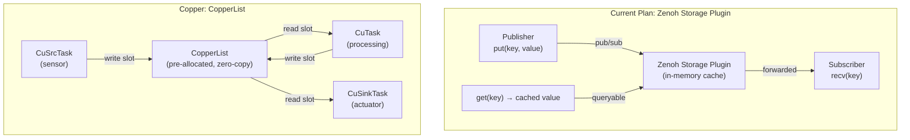

# Zenoh + Copper Overhead Analysis

> Sub-study of [copper_study.md](copper_study.md) — §4.4 "Zenoh overhead".

## Question

I already have in mind to use Zenoh to synchronize data and keep a local cache using the
storage plug-in. Would the translation to Copper induce a lot of overhead?

---

## Findings

### 1. Copper Already Uses Zenoh Internally

Copper's ROS 2 bridge and distributed execution are both built on Zenoh. The `cu_zenoh_bridge`
component is a first-class Copper bridge with multi-format support (bincode, JSON, CBOR).

**Grounding** — from `components/bridges/cu_zenoh_bridge/README.md`:

```markdown
## Cu Zenoh Bridge

Bidirectional bridge for exchanging messages between Copper task graphs over Zenoh.
Supports bincode, JSON, and CBOR wire formats per-channel.
```

And from the workspace `Cargo.toml`:
```toml
zenoh = "1.7.0"
```

### 2. Architecture: Zenoh Storage vs Copper CopperList

The two systems handle data flow differently:



### 3. Overhead Comparison

| Aspect | Zenoh pub/sub + Storage | Copper CopperList | Copper + Zenoh Bridge |
|--------|------------------------|-------------------|----------------------|
| **Intra-process latency** | ~1–10 µs (in-process pub/sub) | **< 1 µs** (direct memory access) | ~1 µs (CopperList) + ~10 µs (Zenoh serialize) |
| **Serialization** | Required (JSON, CBOR, etc.) | **None** (zero-copy typed slots) | Required at bridge boundary only |
| **Memory allocation** | Per-message allocation | **Pre-allocated** (no alloc in critical path) | Pre-allocated inside Copper, alloc at Zenoh boundary |
| **Type safety** | Runtime (encoding + schema) | **Compile-time** (generic typed messages) | Compile-time inside Copper, runtime at Zenoh boundary |
| **Cache/query** | Built-in (storage plugin) | Not built-in (each task holds its own state) | Zenoh storage for external queries, Copper for internal |
| **Determinism** | Non-deterministic (async delivery) | **Deterministic** (topological order, unified clock) | Deterministic internally, non-deterministic at Zenoh boundary |
| **Replay** | Not built-in | **Built-in** (unified log + freeze/thaw) | Replay of internal state only |

### 4. Where Overhead Occurs

If using Copper with a Zenoh bridge to synchronize with external systems:

```text
                   Zero-alloc, < 1µs          Serialize + Zenoh publish
                 ◄──────────────────►        ◄──────────────────────────►
Sensor ──► CuSrcTask ──► CuTask ──► CuSinkTask ──► cu_zenoh_bridge ──► Zenoh Network
                                                         │
                                                    ~10-50 µs overhead
                                                    (serialization +
                                                     Zenoh put + async)
```

The overhead at the Zenoh bridge boundary includes:
1. **Serialization**: bincode (~1 µs), JSON (~5-20 µs), CBOR (~3-10 µs) depending on payload size
2. **Zenoh put**: ~5-15 µs for in-process delivery, ~50-200 µs for network
3. **Async bridging**: The bridge offloads I/O to best-effort phase, not blocking the critical path

### 5. The Translation Overhead

If you're currently planning a Zenoh-first architecture (from the zenoh-study):

```text
Device Controller ──► Zenoh put("state/{id}/joint1/position") ──► Storage Plugin ──► Studio subscriber
```

Translating this to Copper + Zenoh would look like:

```text
Sensor (CuSrcTask) ──► PID (CuTask) ──► cu_zenoh_bridge ──► Zenoh put(...) ──► Storage Plugin ──► Studio
```

**The overhead delta is minimal:**

| Operation | Zenoh-only | Copper + Zenoh | Difference |
|-----------|-----------|----------------|------------|
| Sensor → Controller | Zenoh pub/sub (~10 µs) | CopperList (~0.1 µs) | **Faster in Copper** |
| Controller → Studio | Zenoh pub (~10 µs) | Zenoh pub (~10 µs) | **Same** |
| Total internal | ~20 µs per hop | ~0.1 µs + ~10 µs | **Similar** |
| Serialization | 1 per hop | 1 per external boundary | **Fewer in Copper** |

**Key insight**: Copper *reduces* overhead for the internal pipeline (sensor → processing →
actuator) because CopperList is zero-copy. The Zenoh boundary overhead is identical to what
you'd have without Copper.

### 6. Can Zenoh Storage and Copper Coexist?

Yes, and there are two patterns:

**Pattern A: Copper drives, Zenoh exports**

The Copper task graph runs the control loop. A `cu_zenoh_bridge` sink publishes selected
state to Zenoh. The Zenoh storage plugin caches it for external queries (Studio, monitoring).

```ron
(
    tasks: [
        (id: "sensor", type: "tasks::JointSensor"),
        (id: "controller", type: "cu_pid::GenericPIDTask", config: {...}),
        (id: "actuator", type: "tasks::JointMotor"),
    ],
    bridges: [
        (
            id: "zenoh", type: "bridges::StateExportBridge",
            config: {"wire_format": "json"},
            channels: [
                Tx(id: "position", route: "state/{device_id}/joint1/position"),
                Tx(id: "velocity", route: "state/{device_id}/joint1/velocity"),
            ],
        ),
    ],
    cnx: [
        (src: "sensor",     dst: "controller", msg: "JointReading"),
        (src: "controller", dst: "actuator",   msg: "JointCommand"),
        (src: "sensor",     dst: "zenoh/position", msg: "JointReading"),
        (src: "controller", dst: "zenoh/velocity", msg: "JointCommand"),
    ],
)
```

**Pattern B: Zenoh feeds into Copper**

External data (e.g., Studio commands) arrives via Zenoh and enters the Copper graph
through Rx channels:

```ron
bridges: [
    (
        id: "zenoh", type: "bridges::StudioCommandBridge",
        channels: [
            Rx(id: "target", route: "cmd/{device_id}/joint1/target_position"),
        ],
    ),
],
cnx: [
    (src: "zenoh/target", dst: "controller", msg: "JointTarget"),
],
```

### 7. Impact on Zenoh Storage Plugin

The Zenoh storage plugin works identically whether data comes from a raw Zenoh publisher
or from a Copper Zenoh bridge. The bridge publishes to Zenoh key expressions just like
any other publisher.

```text
cu_zenoh_bridge ──put("state/{id}/joint1/position", "1.5")──►  Zenoh Session
                                                                     │
                                                              Storage Plugin
                                                              (in-memory cache)
                                                                     │
                                                              get("state/{id}/**")
                                                              → returns cached values
```

No changes needed to the storage plugin configuration or Zenoh topology.

---

## Summary

| Question | Answer |
|----------|--------|
| Does Copper add overhead to Zenoh? | **No** — internal overhead is lower (zero-copy). Zenoh boundary cost is identical. |
| Can Zenoh storage coexist? | **Yes** — Copper publishes to Zenoh via bridge, storage plugin caches transparently. |
| Is the translation complex? | **Moderate** — each `StateChange` key becomes a typed CopperList connection. Requires mapping the key-value model to typed messages. |
| What's lost? | Dynamic key discovery (new keys at runtime). Copper connections are compile-time. |
| What's gained? | Deterministic replay, zero-alloc critical path, compile-time type safety. |
