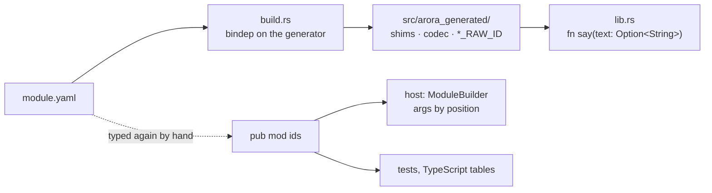
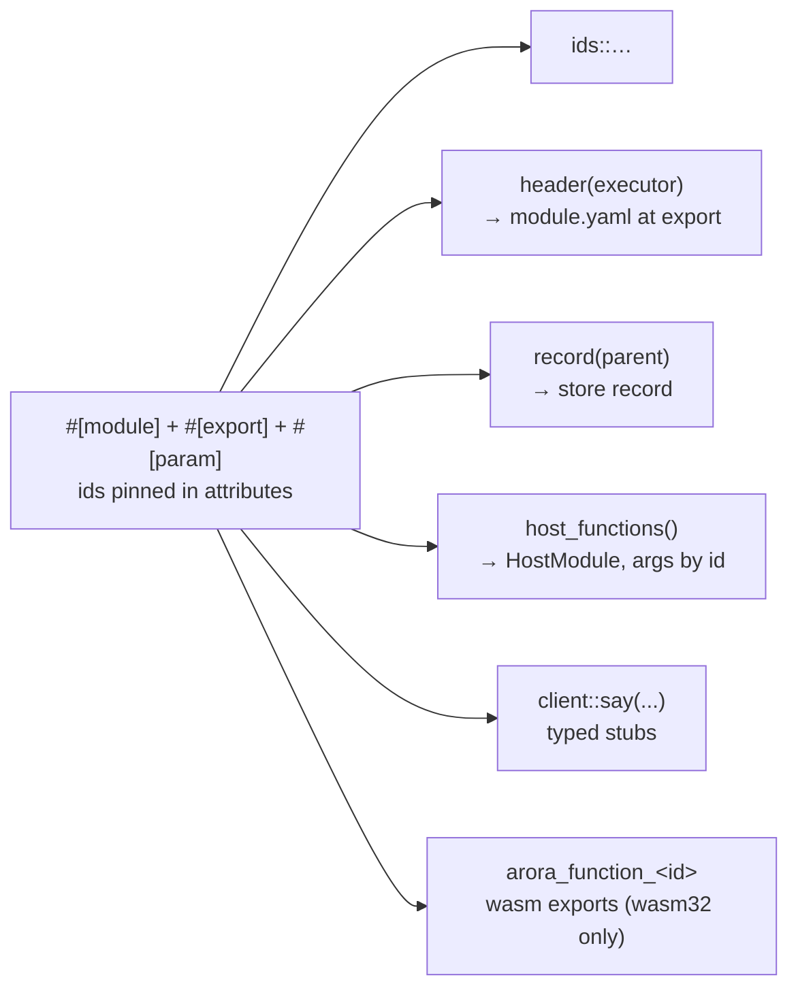

# Declaring Arora modules in Rust — reading guide

Five slides on what the [study](README.md) establishes, seen from the desk of
the developer who writes, hosts or calls a Rust module. Every claim links to
the page and test that carries it.

---

## 1. What we are doing and what we get

A Rust crate carries its Arora module's interface: a macro on the module, one
on each exported function, ids pinned in attributes — the way
`#[derive(AroraType)]` already lets a Rust type carry its schema.

- **One declaration instead of many copies.** Today the animation module's ids
  are typed by hand in five places (`module.yaml`, `pub mod ids`, the host
  builder, a test, a TypeScript table). After: one place, everything else
  derives from it.
- **Deleted, not rewritten:** every Rust module's `build.rs`, its
  `src/arora_generated/` directory, and its build-time dependency on the
  generator (`arora-module-core`, `arora-module-rust`, `arora-registry`,
  `tokio`).
- **Checkable:** a module's header, store record, host closures, client stubs
  and wasm exports come from the same tokens, so they cannot drift apart. The
  prototype's 37 tests show each equal to what the generator or the hand-written
  code produces today.
- **The generator stays** for C++ and for modules that are not written in Rust.

Source: [README — vision and features](README.md#the-vision),
[inventory](inventory.md).

---

## 2. Today: writing a Rust module



The author writes the interface in YAML, wires a `build.rs` that runs the
generator through a registry on every build, commits the generated sources,
and implements each function with `Option<T>` parameters because the shim
hands an absent argument as `None`. A host that registers the same module
retypes every id and reads arguments by position, which nothing checks
(VIZ-129). A host-only module (vizij's tts, gaze) has no header at all: its
signatures are built by hand, three times for one `say`.

Source: [case: polly — today](case-polly.md#today),
[case: animation — today](case-animation-arora-81.md#today),
[case: vizij host modules — today](case-vizij-host-modules.md#today).

---

## 3. After: the module is the declaration



```rust
#[arora::module(id = "a1a6bb9a-…", name = "polly", version = "0.1.0")]
pub mod polly {
  #[export(id = "e1b4bda7-…")]
  pub fn say(#[param(id = "fb3787f2-…")] text: String) -> Status { … }
}
```

Names are the prototype's shapes, not the final API. Parameters are plain
Rust types: a missing or mistyped argument fails the call by name. The module
crate depends on `arora-types` only; the host crate assembles the `HostModule`.

Source: [mechanism page](mechanism-declaration-macro.md),
[case: polly — with the macros](case-polly.md#with-the-declaration-macros).

---

## 4. How it feels, per role

| Role | Today | After |
|---|---|---|
| **Author of a native or wasm module** | `module.yaml`, `build.rs`, generated sources, `Option<T>` parameters | attributes on the module and its functions; plain parameter types; no build step |
| **Host integrator** (a device registering the module) | `ModuleBuilder::new(ids::MODULE).function(ids::SAY, \|call\| … arg(&call, 0) …)`, ids retyped | `host_module::<polly::Module>()`: ids, signatures and marshalling from the declaration |
| **Caller** (another crate, a graph, a test) | `Call { module_id, id, args }` built by hand, or generated stubs behind a `build.rs` | `polly::client::say(&mut bridge, text)?`; for a module that is not Rust, `module_from_header!("module.yaml")` |
| **Exporter** (publishing to a store, writing a `module.yaml`, a TypeScript table) | the YAML is the source; host-only modules have nothing to export | `header(executor)` and `record(parent)` from the declaration, for every module |
| **Type author** | `#[derive(AroraType)]` plus hand-written `From`/`TryFrom<Value>` | the derive emits both, from the same ids, with the type's record version |

What the author no longer maintains: `build.rs`, `src/arora_generated/`, the
generator bindep, and the `Option<T>` convention. What stays out of reach: the
interpreter module (its payloads hold maps).

Source: [case: imports](case-imports.md), [case: wasm guest](case-test-rust-wasm.md),
[case: interpreter module](case-interpreter-module.md), [Q2](open-questions.md#q2).

---

## 5. Decided, what is asked, and next

Decided during the study (2026-09-11 to 2026-09-22), each with its rationale in
[open-questions.md](open-questions.md): a parameter's Rust type is the declared
type (Q1); `#[derive(AroraType)]` emits the `Value` conversions (Q2) and
carries the type's version (Q6); the declaration exposes free items plus an
`AroraModule` trait (Q3); the host crate assembles the `HostModule` (Q4);
inline `#[module]` or `declare_module!` for out-of-line modules (Q5); the guest
shims come from the declaration (Q7); client stubs from the declaring crate or
from a header (Q8), bound to the module id (Q9); a host-only module has no
header, so `Header::executor` stays required (Q10).

**Asked of reviewers:** read the decisions and say which you would reopen; the
cases and the prototype are the evidence, not the object of the review.

**Not exercised:** the shim under a native cdylib (only wasm32 ran); a wasm
guest calling another module (needs a `CallBridge` over `arora_dispatch`).

**Next:** the `arora-types` half is
[PR #230](https://github.com/semio-ai/arora-sdk/pull/230); the macros crate,
the polly and test-rust-wasm conversions and the prototype's deletion follow
under [ARORA-81](https://linear.app/semio-ai/issue/ARORA-81/declare-arora-modules-in-rust).

Source: [open-questions.md](open-questions.md),
[case: polly — not covered](case-polly.md#not-covered-on-this-case),
[case: imports — not covered](case-imports.md#not-covered).
