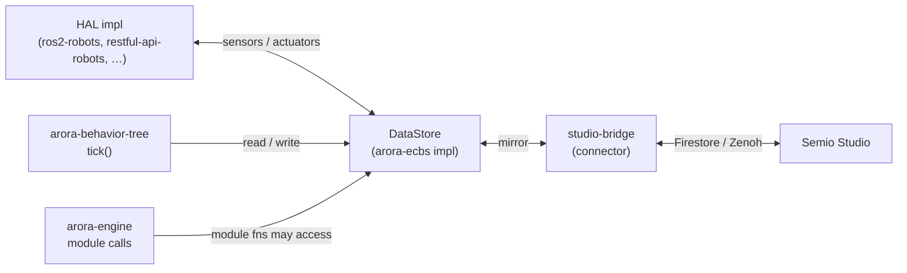
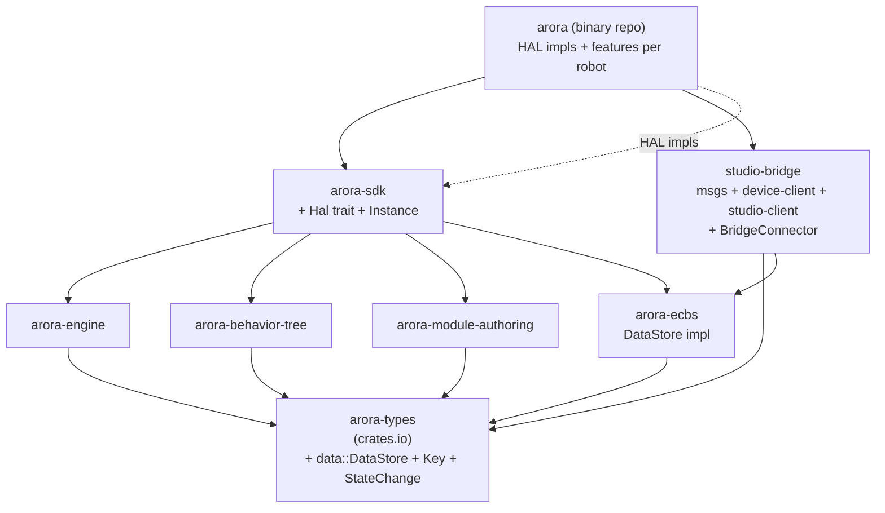
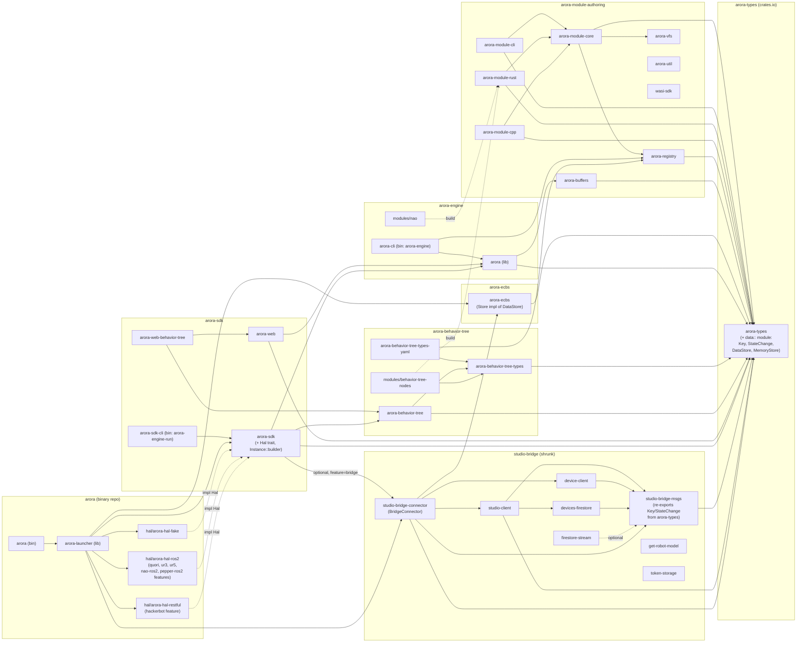
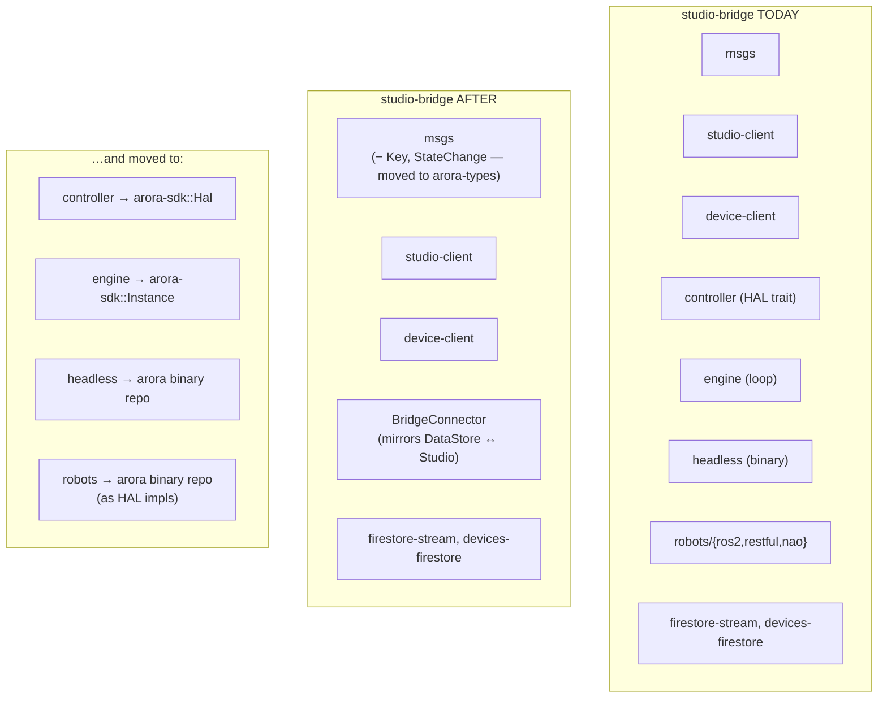
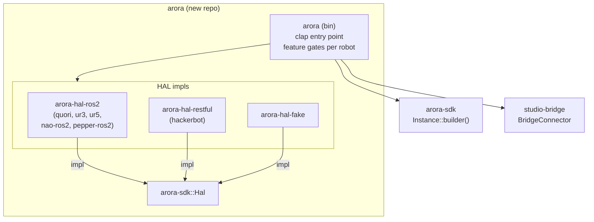

# Proposal 2: pulling studio-bridge into the Arora architecture

Status: draft, for review.
Date: 2026-06-01.
Author: Victor (with research help from an LLM agent).

Companion to and continuation of
[`proposal-split-arora-repos.md`](proposal-split-arora-repos.md).
Read that first — this document assumes the
engine / module / SDK / BT split, the "extraction recipe", and the
existence of `arora-sdk` as the integration layer.

This proposal extends the picture to bring `studio-bridge` and its
satellite crates into the new shape, and to introduce a shared data
interface that the bridge, the HAL, and behavior execution can all
agree on.

---

## 1. Context

`studio-bridge` today is a single workspace holding:

```
studio-bridge/
├── msgs                     # wire schemas (Key, Value, StateChange, …)
├── studio-client            # talks to Semio Studio (Firestore + Zenoh + REST)
├── device-client            # talks to the device side (Firestore + Zenoh)
├── controller               # HAL trait + FakeController
├── engine                   # the loop that ties device-client ↔ controller
├── headless                 # the binary, feature-gated per robot
├── robots/
│   ├── ros2-robots          # ROS 2-backed Controller impls
│   ├── restful-api-robots   # REST-backed Controller impls
│   └── nao                  # NAO-specific Controller
├── firestore-stream         # generic Firestore subscription helper
├── devices-firestore        # devices-collection wrapper
├── get-robot-model          # tool
└── token-storage            # tool
```

Three of these crates are concerns that belong elsewhere now that
the Arora Engine exists:

- **`controller`** — a Hardware Abstraction Layer. The bridge is one
  consumer; a future BT-driven execution would be another. This is
  not bridge-specific.
- **`engine`** — a simple driver loop. The Arora Engine replaces
  it; the loop becomes an `arora-sdk::Instance` configured with a
  device-client and a HAL.
- **`headless`** — the actual robot entry point. Per-robot feature
  flags suggest it is really a *distribution*, not part of the
  bridge.

Everything else (msgs, studio-client, device-client, the bridging
loop between a local data store and Studio, the firestore helpers)
is genuinely bridge work and stays in `studio-bridge`.

There is also `arora-ecbs/`, currently an empty repo. Its intended
role per Victor is the data layer that the HAL, the bridge, and
behavior execution engines like the behavior-tree all read from and
write to. We treat it as the canonical implementation of a
`DataStore` interface that lives in `arora-types`.

---

## 2. Goals

1. **Make the HAL a first-class Arora concept.** Currently
   `StudioBridgeController` references studio-bridge schema (`Key`,
   `PartialDeviceModel`, `StateChange`). The new HAL trait should
   depend only on `arora-types` so that any execution engine
   (engine itself, BT, future module) can produce or consume HAL
   state without pulling the bridge in.
2. **Make the bridge a connector, not a runtime.** After the move,
   `studio-bridge` is a thing that mirrors a local `DataStore` ↔
   Studio. It does not own the loop, the executor, or the HAL.
3. **Make `arora` the binary.** A new repo, named simply `arora`,
   is the deliverable robot launcher: pick HAL impls via feature
   flags, plug in `arora-sdk` + `studio-bridge`, ship.
4. **Introduce a shared data interface.** A `DataStore` trait in
   `arora-types` so the HAL, the bridge, and any execution engine
   talk to the same blackboard. `arora-ecbs` is the canonical impl.

---

## 3. Where does the HAL live?

Victor's hesitation: the engine is, ultimately, a runtime for
robotics. The HAL is always present. Should it sit at the engine
level (`arora-engine`) or at the integration level (`arora-sdk`)?

The recommendation is **`arora-sdk`, for now**. Reasoning:

- `arora-engine` is a module loader + executor. It does not need to
  know about robots. Adding the HAL there mixes concerns: a
  hypothetical headless test engine running pure-software modules
  would suddenly need to think about HAL even when there is no
  hardware. That is a leaky abstraction.
- The HAL is meaningful only when something is driving real
  hardware — that is exactly what `arora-sdk` exists to set up.
- If, later, the engine grows a feature that demands HAL-aware
  scheduling (e.g. priority hooks tied to actuator state), promote
  the trait. Promotion from `arora-sdk` → `arora-engine` →
  `arora-types` is a one-line `pub use` move at each step. The
  reverse is harder.

The trait itself stays lean and depends only on `arora-types`:

```rust
// arora-sdk/crates/arora-sdk/src/hal.rs
use arora_types::{value::Value, data::{Key, StateChange}};

#[async_trait]
pub trait Hal: Send + Sync {
    async fn describe(&self) -> HalDescription;
    async fn read(&self, keys: &[Key]) -> HalResult<Vec<Option<Value>>>;
    async fn write(&mut self, changes: StateChange) -> HalResult<()>;
    /// Stream of changes pushed by the hardware (sensors, etc.).
    fn updates(&mut self) -> Pin<Box<dyn Stream<Item = StateChange> + Send>>;
}
```

The current `StudioBridgeController` shape (`get_model`,
`get_model_glb`, `get/update/get_all` keyed by `Key`) collapses
into this. The bridge-flavored `PartialDeviceModel` / `DeviceInfo`
remain in `studio-bridge-msgs` and are wrapped by the bridge, not
by the HAL trait.

This means `arora-types` grows two things in service of this
proposal:

- `arora_types::data::{Key, StateChange}` — the data-store
  vocabulary that HAL, BT, and bridge all share. `Key` is currently
  in `studio-bridge-msgs`; it moves.
- `arora_types::data::DataStore` — the trait described in §4.

---

## 4. The data interface

Three things need to read and write the same state:

- The **HAL** publishes sensor readings, accepts actuator commands.
- The **bridge** mirrors state both ways between the local store
  and Semio Studio.
- An **execution engine** like the BT reads sensor values
  ("is_obstacle_close") and writes intent ("set_velocity").

If these talked to each other directly, every pair would need an
adapter. Instead, they all talk to a shared in-process store:



The trait:

```rust
// arora-types/src/data.rs
pub trait DataStore: Send + Sync {
    fn read(&self, keys: &[Key]) -> Vec<Option<Value>>;
    fn write(&mut self, changes: StateChange) -> Result<(), DataError>;
    fn subscribe(&self) -> Box<dyn Stream<Item = StateChange> + Send + Unpin>;
    fn snapshot(&self) -> HashMap<Key, Value>;
}
```

Implementations:

- **`arora-ecbs`** — canonical, persistent / structured. Probably
  what production runs. The repo is empty today; this proposal is
  what motivates filling it.
- **`arora-sdk` in-memory default** — a `HashMap`-backed
  implementation, useful for tests, demos, the wasm build, and any
  process that does not need persistence.

The engine (the `arora` crate) gets a hook to provide a `DataStore`
handle into module calls if needed; for module authors who don't
use it, it costs nothing.

Honest check: is this trait the right shape? Three smells to watch:

1. `read` is synchronous; HAL impls may want async I/O. Solution:
   the HAL is what does I/O, not the store. The store is in-process
   memory. HAL pushes to store via `write`; consumers `read` from
   memory. If the store needed to back out to Firestore, that is
   the bridge's job.
2. `Key` shape. The current `Key` in `studio-bridge-msgs` is a
   nested path; this generalises fine. The first PR validates that.
3. Backpressure. If subscribers fall behind, the store buffers per
   subscriber. Lift from the current studio-bridge implementation,
   which already handles this for its tokio mpsc channels.

If any of these turn out wrong in the first implementation, the
trait moves before more code depends on it. This is the same
principle as moving `CallBridge` early (proposal 1, §3).

---

## 5. Target repo layout

Adding to the five repos from proposal 1:

| Repo | Role (after this proposal) | Depends on |
|------|------|------|
| `arora-types` | + `data::{Key, StateChange, DataStore, DataError}` | unchanged |
| `arora-ecbs` | Canonical `DataStore` impl | `arora-types` |
| `arora-module-authoring` | unchanged | unchanged |
| `arora-engine` | unchanged | unchanged |
| `arora-behavior-tree` | Can now consume a `DataStore` for blackboard reads/writes | + `arora-types` (already) |
| `arora-sdk` | Owns the `Hal` trait; `Instance::builder()` accepts a `DataStore` and an optional `Hal` | + `arora-ecbs` (as default impl) |
| `studio-bridge` | Only msgs, device-client, studio-client, firestore helpers, and a `BridgeConnector` that mirrors a `DataStore` ↔ Studio. No engine, no controller, no headless. | + `arora-types`, + `arora-ecbs` (optional, by API contract) |
| `arora` (new) | The robot binary. Per-robot HAL impls + `arora-sdk` + `studio-bridge`. Feature-gated. | + `arora-sdk`, + `studio-bridge`, + HAL crates |

### 5.1 Dependency graph (target)



Solid arrows: runtime deps. Dashed: trait implementation (the
per-robot HAL crates inside `arora` implement
`arora-sdk::Hal`).

#### Full crate-level view

Every repo this proposal touches, every crate inside it, every
dependency edge. Builds on proposal 1's crate-level graph (§2.2)
— same conventions: solid = runtime dep, dashed = build/test or
trait impl. The four new things relative to proposal 1 are
`arora-types::data`, the `arora-ecbs` repo, the shrunk
`studio-bridge` workspace, and the new `arora` binary repo.



Notes:

- The only crates outside `arora` (the binary repo) that learn
  about `studio-bridge` are inside `arora-sdk` (and only via an
  optional `bridge` feature on `arora-sdk`). The engine, BT,
  module tooling, and types stay bridge-free.
- `arora-ecbs` has exactly one incoming edge in this picture
  (`studio-bridge-connector`) plus the launcher. That is the
  point: the trait is in `arora-types`, the impl is consumed
  where instances are constructed.
- `studio-bridge-msgs` keeps the wire format but no longer
  defines `Key`/`StateChange` — it re-exports them from
  `arora-types::data`. Wire compatibility is a property of the
  *serde representation* on the re-exported types (proposal §7
  bullet 1).

No cycles. `studio-bridge` and `arora-sdk` are siblings on top of
`arora-types` + `arora-ecbs`. `arora` is the only repo that sees
both, the same way `arora-sdk` is the only repo that sees both
`arora-engine` and `arora-behavior-tree` in proposal 1.

### 5.2 What `studio-bridge` looks like, before and after



`studio-bridge` shrinks to "the thing that talks to Studio over
Firestore + Zenoh, and exposes a DataStore-shaped surface to
whoever is running locally."

### 5.3 What `arora` (the new binary) looks like



The flow at runtime:

1. Parse CLI args (`--robot ur5 --studio-token …`).
2. Build the data store (default: `arora-ecbs::Store::new()`).
3. Build the HAL (the feature-selected impl).
4. Build the bridge connector (with the data store handle + studio
   client credentials).
5. Build the SDK `Instance::builder()` (with the engine, the BT,
   the data store, the HAL). `build()` → an instance.
6. Run.

The binary is named `arora`, per Victor's plan. The repo-level
`arora-engine` binary from proposal 1 remains as the
*headless-module-runner* (load a module, call a function — no HAL,
no bridge).

---

## 6. Usage examples

### 6.1 The robot entry point (Rust)

```rust
// arora/src/main.rs
use arora::prelude::*;

#[tokio::main]
async fn main() -> anyhow::Result<()> {
    let args = Args::parse();
    let store = arora_ecbs::Store::new();

    // HAL: chosen by feature flag at compile time.
    let hal: Box<dyn Hal> = build_hal(&args, store.handle())?;

    // Bridge: mirrors the local store to Studio.
    let bridge = studio_bridge::BridgeConnector::new()
        .with_data_store(store.handle())
        .with_studio_client(studio_bridge::studio_client::zenoh::ZenohStudioClient::new(args.studio_url)?)
        .with_device_client(studio_bridge::device_client::firestore::Client::new(args.token)?)
        .build()
        .await?;

    // The Arora instance: engine + BT + data store + HAL.
    let instance = arora_sdk::Instance::builder()
        .with_wasmtime_executor()
        .with_behavior_tree_nodes()
        .with_data_store(store)
        .with_hal(hal)
        .with_bridge(bridge)
        .build()?;

    instance.run().await
}
```

If you take the bridge out, the same binary works for an offline
robot. If you take the HAL out, you get a pure simulator. If you
take both out, you get the headless module-runner.

### 6.2 The bridge in isolation

```rust
// Embed studio-bridge alone (e.g. in a test rig that does not
// run real behavior).
let store = arora_ecbs::Store::new();
let bridge = studio_bridge::BridgeConnector::new()
    .with_data_store(store.handle())
    .with_studio_client(...)
    .with_device_client(...)
    .build()
    .await?;

// Drive the store manually — anything you write here gets mirrored.
store.write(StateChange::set("battery/level", Value::F32(0.95)))?;

bridge.run().await?;
```

### 6.3 BT reading sensor data

```rust
// Inside a BT node implementation
let store = ctx.data_store();
let obstacle_close = store.read(&[Key::from("sensors/lidar/min_dist")])
    .pop().flatten()
    .map(|v| v.as_f32().unwrap() < 0.5)
    .unwrap_or(false);
if obstacle_close { Status::Failure } else { Status::Success }
```

The BT doesn't know whether the HAL is real, fake, or absent. It
asks the store; the store has whatever the HAL last published.

---

## 7. Where this is *not* yet easy

- **`Key` schema fights.** `Key` today is in
  `studio-bridge-msgs`, used by both `device-client` (wire format)
  and `controller`. Moving it to `arora-types` means the wire
  format and the in-process key share a type. That is what we want
  conceptually, but if the wire format needs to evolve
  independently (e.g. for compatibility), we will regret coupling
  them. Mitigation: version `arora-types` carefully — `Key` becomes
  an additive type, never restructured in place.

- **The bridge is no longer the boss of the loop.** Today
  `studio-bridge-engine` orchestrates "wait on studio messages,
  apply to controller, send back". After the move, the
  `arora-sdk::Instance` owns the loop and the bridge is a tokio
  task that the instance polls. The error/lifecycle semantics
  change — if the bridge dies, does the instance die? The current
  bridge returns `Err(String)` and the binary exits. The instance
  needs to provide the same behavior via task supervision or this
  is a regression. Acceptance criterion: the binary's exit
  behaviour for "device unregistered from Studio" matches today.

- **HAL impl crates currently live under
  `studio-bridge/robots/`.** They depend on
  `studio-bridge-controller` directly. After the controller trait
  moves, they depend on `arora-sdk`. That is the right shape but
  it means the robot-specific impls move out of studio-bridge to
  the `arora` binary repo. Re-check: are any of them genuinely
  reusable outside `arora`? If yes, they get their own crate;
  probably not, in which case they live as `arora/hal/*` subcrates.

- **`arora-ecbs` does not exist yet.** The repo is empty. We are
  proposing a data layer and assigning it a target repo at the
  same time. The first slice of that repo can be small (just
  enough to back §4's `DataStore` trait with a `HashMap`) — but it
  needs to be done before any of this lands.

---

## 8. Risks and open questions

1. **Did we get HAL placement right?** Recommendation is
   `arora-sdk`. If a use case shows up where the engine itself
   needs the HAL trait visible (e.g. host functions that introspect
   "what HAL am I running on?"), promote to `arora-engine` or
   `arora-types`. Promotion is cheap, demotion is not.

2. **Should `Key`/`StateChange`/`DataStore` go to a new
   `arora-data` crate instead of into `arora-types`?** Argument
   for: keeps `arora-types` from growing concerns. Argument
   against: every consumer of `arora-types` is already a consumer
   of these types in practice. Net: keep them in `arora-types`
   under a `data::` module; if the surface grows past ~500 lines,
   reconsider. Decision needed before plan PR 2.

3. **`animation-player` dependency.** Current
   `studio-bridge-engine` pulls in `animation-player` for an
   internal animation pipeline. That belongs to the SDK or to the
   binary repo, not to the bridge. The plan moves it to
   `arora-sdk` (or makes it a feature of `arora`). Decide which.

4. **`arora-ecbs` API contract before it exists.** The proposal
   writes the trait first, the impl after. If `arora-ecbs` turns
   out to need a different shape (entity-component is plural by
   nature; "key/value" may be too thin), the trait in
   `arora-types` will need rework. Build the trait + a `HashMap`
   impl in `arora-types` first; promote the structural choice into
   `arora-ecbs` only once the shape settles.

5. **The `arora` binary repo name.** Public; collides with the
   `arora` crate inside the engine repo. Suggested mitigation:
   the binary is `arora` but the workspace's library crate is
   `arora-launcher` or similar. Crate name and binary name need
   not match.

---

## 9. Sequencing relative to proposal 1

This work depends on proposal 1's `arora-sdk` existing. Concretely:

- It can start once **proposal 1 PR 1** lands (CallBridge in
  arora-types). The data interface (§4) is the same kind of
  interface-layer addition.
- It can land its first slice (the `DataStore` trait + a HashMap
  impl in arora-types) without waiting for the rest of proposal 1.
- The bigger moves (controller → SDK, headless → arora binary,
  engine → SDK Instance) need `arora-sdk` to exist, which is
  proposal 1 PR 7.

The full plan is in
[`plan-bring-studio-bridge-in.md`](plan-bring-studio-bridge-in.md).

---

## 10. Next step

If approved: do the data-interface slice first
(plan §PR 1: `arora-types` adds `data` module, `arora-ecbs` gets a
HashMap impl). It is independent of proposal 1's PR sequence and
unblocks the HAL extraction.

The HAL/engine/headless moves come after proposal 1 PR 7
(`arora-sdk` exists). Stop and reassess at that point: by then
`arora-sdk::Instance` will be defined for "engine + BT", and we
will know whether extending it to "engine + BT + HAL + bridge" is
a small step or a big one.
