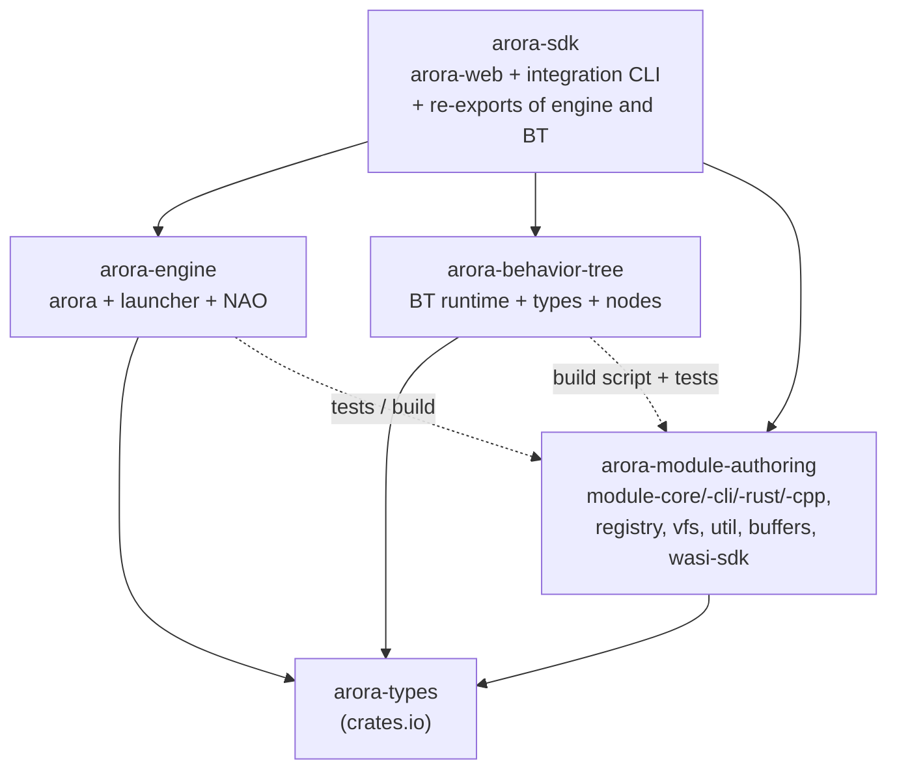
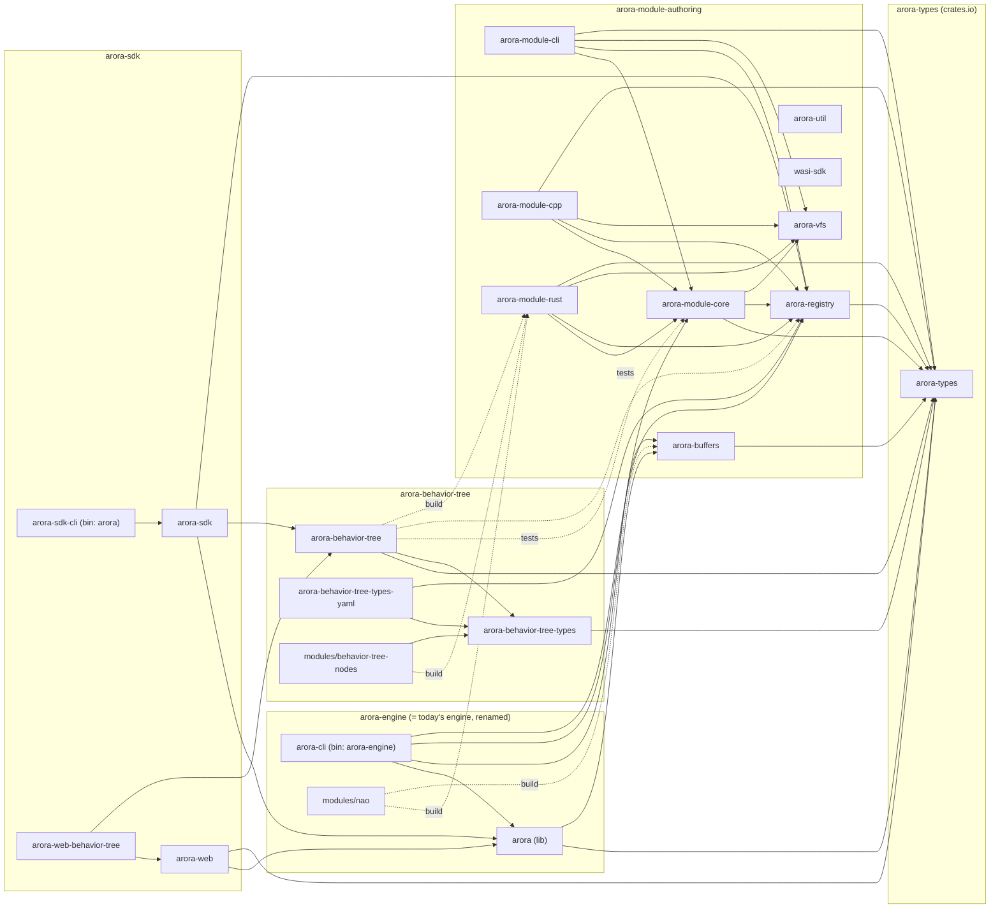
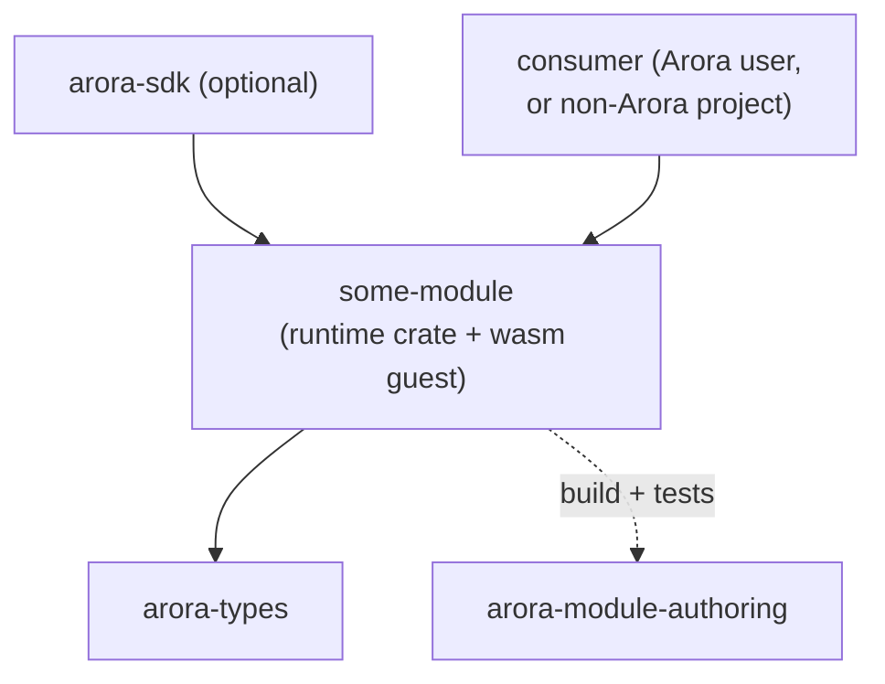
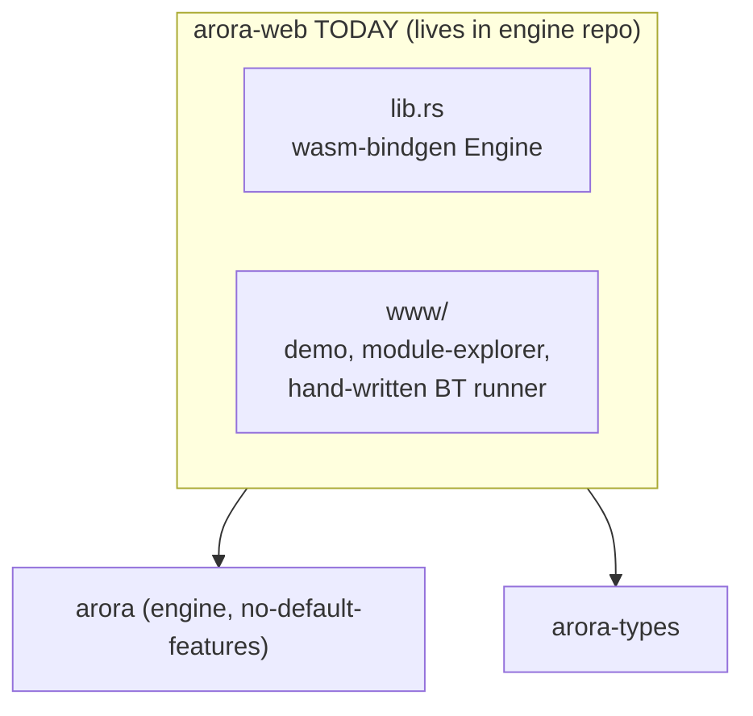
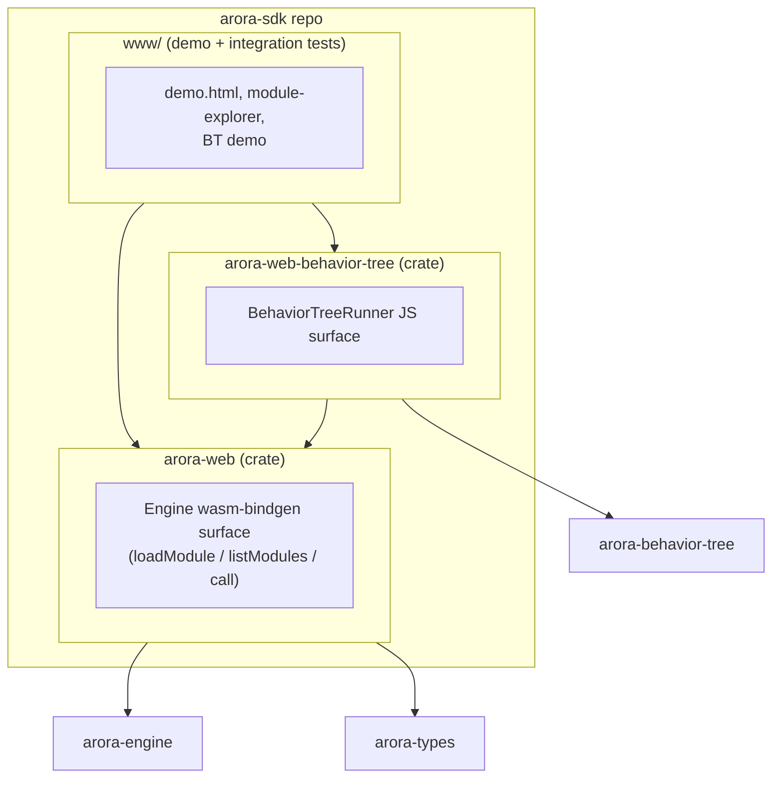
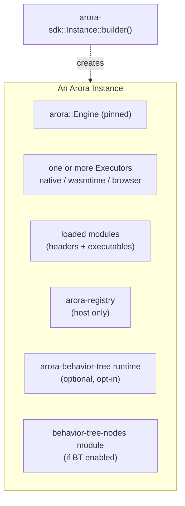

# Proposal: a clean extraction pattern for Arora modules, piloted with behavior-tree

Status: draft, for review.
Date: 2026-06-01 (revised 2026-06-10).
Author: Victor (with research help from an LLM agent).

Revision note (2026-06-10): some groundwork already landed and is
reflected below — the repo rename `engine` → `arora-engine`, the
`semio-client`/`semio-record` move onto `main`, and clippy + fmt in the
engine's CI. The substantive work (move `CallBridge` into `arora-types`,
extract BT, `arora-module-authoring`, `arora-sdk`) is still pending.

This document proposes a way to extract Arora modules (and module-shaped
libraries like the behavior-tree runtime) into standalone repositories,
in a form that keeps them reusable outside the engine. The
behavior-tree is the pilot: it is the closest thing we have to a
"complete module + supporting library" and it is the one we already
tried to extract once.

The treatment in this document applies to it specifically, but the
shape it produces is meant to be the recipe for future extractions.

The four trees in scope:

- `arora-engine/` (this repo) — engine + module tooling + all modules + arora-web
- `arora-types/` — already extracted, on crates.io
- `arora-behavior-tree/` — a placeholder snapshot of the engine's BT crates
  pushed earlier as a "quick first move". Not a true extraction yet
- (new) repos created as part of the recipe: `arora-module-authoring`, `arora-sdk`

> **`arora-web`** (named here for the first time) is the engine's
> tentative stand-alone web binding — a `wasm-bindgen` surface that
> could ship as an NPM package to run Aroras anywhere on the web. A Rust
> consumer such as Studio RS will likely depend on `arora-engine`
> directly rather than on this web binding, whereas a web-side consumer
> such as the Vizij Workspace could depend on `arora-web` directly. This
> proposal is the next step of evolution, not the final target — whether
> `arora-web` ultimately survives is left open. Its shape today and
> after the split is detailed in §2.4.

Discussions and Agreements:

- Tiago: buffers should go into arora-types if it becomes the shared ser/de solution for them.
  Otherwise it's fine in the arora-module-authoring repo. Until further notice it's actually ok.
  Shouldn't we use a fixed data storage between modules, with a shared pointer
  between them, to avoid writing buffers all the time?
- Chris: worried that we'd need to pass animation data at every tick, but that is not the case. It raises many questions about data interface, but indeed it's not needed yet to answer them.
- Andy: worried we can't trace what's being called between modules. Tracing solutions are possible, but that won't provide a fixed channel to track. Victor says it's actually not meant to be interesting because Studio will either call the methods directly (ins and outs will be at hand), or through the behavior tree (variables are used in between nodes, no call stack).
- Victor: buffers are fine in arora-module-authoring. But if it becomes the shared ser/de solution,
  it should go into arora-core. But this decision is pretty easy to change in the future, so let's go?
  Discussions about data storage shared between modules is interesting,
  but not decisive for the current transition. It's more an implementation detail, since behavior trees do not care nor module interfaces.
  We can still add it as we see fit, when we put together the HAL and the bridge,
  which probably are not even modules.
  
---

## 1. Context and goal

### 1.1 What we have today

The engine workspace currently owns:

```
arora-engine/
├── crates/
│   ├── arora                  # engine core (host + browser dual-target)
│   ├── arora-buffers
│   ├── arora-cli              # host launcher
│   ├── arora-web              # wasm-bindgen JS surface
│   ├── arora-module-core      # module/type analysis
│   ├── arora-module-cli       # codegen host tool
│   ├── arora-module-rust
│   ├── arora-module-cpp
│   ├── arora-registry
│   ├── arora-util
│   ├── arora-vfs
│   ├── arora-behavior-tree              # BT runtime
│   ├── arora-behavior-tree-types
│   └── arora-behavior-tree-types-yaml
└── modules/
    ├── behavior-tree-nodes    # wasm guest of BT primitives
    ├── nao, polly, test-*, ...
```

`arora-types` is already a separate repo, published to crates.io as
`arora-types = "1"`. Everything else is in-tree.

`arora-behavior-tree/` (the standalone repo) currently mirrors the
engine's BT crates and git-deps `arora`/`arora-buffers` back. It is
not in active use — treat it as a placeholder that proves the
"quick" extraction shape and now needs to become the right shape.

### 1.2 What we want

A repeatable answer to the question "how do I move a module out of
`engine/` and have it live well on its own?"

A clean extraction is one where the new repo:

- depends on the **interface layer** (types, traits, ABI) — not on the
  engine
- depends on the **module tooling** for codegen and tests — not on the
  engine
- can be consumed by a non-Arora project (Vizij, an open-source user)
  by depending on the same interface + tooling layer, with no engine
  pulled in
- can be re-integrated into an Arora distribution without creating a
  cycle

The behavior-tree is the right pilot because:

- It owns both a runtime library (`arora-behavior-tree`) and a
  shipped wasm module (`behavior-tree-nodes`). Anything we learn here
  generalises to modules that only ship the wasm half.
- It is the only "module" today that other Arora-internal code (the
  `arora-web` demo) wants to depend on. The recipe has to handle that
  case from the start, or future modules in the same situation will
  re-create the problem.

### 1.3 What is blocking that today

One concrete dependency. `arora-behavior-tree` depends on four
symbols defined inside `arora` (the engine crate), not inside
`arora-types`:

- `CallBridge` — the trait the runtime uses to make calls
- `Callable` / `CallableId` — the registration handle
- `CallError` — error type returned across that boundary

(All in `arora-engine/crates/arora/src/call.rs`.)

These are interface, not execution machinery. They reference only
`Call`, `CallResult`, `Value`, `Uuid` — all already in `arora-types`.
But because they live in `arora`, any "module" that needs to make
calls back into the host has to depend on the engine.

This single misplacement is what made the earlier extraction a
placeholder: the standalone repo had to git-dep `arora` to compile,
which is exactly the dependency a real extraction is supposed to
avoid. Anything else we do here is rearranging deck chairs until
this moves.

A second, smaller blocker: the module tooling
(`arora-module-{core,cli,rust,cpp}`, `arora-registry`, etc.) lives
inside the engine repo. An extracted module needs it at build/test
time, and pulling it in via the engine drags everything along. We
should expose the module tooling as a thing of its own.

---

## 2. Proposed shape

### 2.1 Repos

| Repo | Role | Depends on |
|------|------|------------|
| `arora-types` | Interface layer: types, `Call`, `CallResult`, `Value`, **`CallBridge`/`Callable`/`CallableId`/`CallError`**, buffer ABI. Published to crates.io. | nothing (serde, semver, uuid) |
| `arora-module-authoring` (new) | Module-author toolbox: `arora-module-core`, `-cli`, `-rust`, `-cpp`, `arora-registry`, `arora-vfs`, `arora-util`, `arora-buffers`, `wasi-sdk`. | `arora-types` |
| `arora-engine` (this repo) | The engine library (crate `arora`), the launcher binary, the NAO experiment, the engine's own test suite. | `arora-types`, `arora-module-authoring` (test/build only) |
| `arora-behavior-tree` (existing, refilled) | BT runtime + types + YAML records + `behavior-tree-nodes` wasm module. | `arora-types`, `arora-module-authoring` (build + tests) |
| `arora-sdk` (new) | Integration layer. Owns `arora-web` and the convenience launcher. Re-exports the engine + golden modules preconfigured. | `arora-engine`, `arora-behavior-tree`, `arora-module-authoring` |

### 2.2 Dependency graph (target state)



Solid arrows are runtime dependencies. Dashed arrows are build/test-only.

The crucial property: no cycle. `arora-engine` and `arora-behavior-tree`
are siblings on top of `arora-types` + `arora-module-authoring`. `arora-sdk` is
the only place that sees both.

#### Full crate-level view

Every repo, every crate inside it, every dependency edge. Edges
follow today's `Cargo.toml` `[dependencies]` (audited against the
engine workspace as of 2026-06-01); they are the same after the
split, just crossing repo boundaries instead of `path = "../..."`.



Solid = runtime dependency. Dashed = build- or test-only.
`wasi-sdk` and `arora-util` are leaf crates used at build time by
guest-wasm modules (no incoming arrows visible because consumers
pull them in via `[build-dependencies]` / `cmake`, not normal
`[dependencies]`).

### 2.3 The extraction recipe

For a future module that is *not* behavior-tree (e.g. extracting
polly, or a new third-party module repo), the same shape applies:



The contract for a "properly extracted" module:

1. Its `Cargo.toml` only references `arora-types` and (build/test)
   `arora-module-*`. Never `arora` (the engine crate).
2. Its tests stand on a mocked `CallBridge`. The engine is not
   required to prove the module works. (Integration with the real
   engine moves to `arora-sdk`.)
3. Its CI does not require engine secrets beyond `SEMIO_GIT_CREDENTIAL`
   for shared private deps.
4. Its wasm guest is reproducible from its own repo
   (`cargo build --target wasm32-wasip1 --release`) without engine
   workspace bindeps.

If a candidate extraction cannot meet 1–4, that is a sign the
interface layer (`arora-types`) is missing something. Fix that
first, not the module.

### 2.4 What `arora-web` is, today and tomorrow

Today, `arora-engine/crates/arora-web`:

- Wraps `arora::engine::Engine` with `wasm-bindgen`.
- Loads modules (header JSON + executable bytes).
- Exposes `loadModule`, `listModules`, `call`.
- Has a `www/` demo with a hand-written BT runner — it is already
  reaching across into BT territory.



After the extraction, `arora-web` moves into `arora-sdk` and is split:



This is the same recipe as §2.3 applied to a JS-facing module: the
engine-only surface lives in one crate, the BT-flavored surface
lives next to it and depends on `arora-behavior-tree`. New
first-class modules added later get their own
`arora-web-<module>` crate the same way.

### 2.5 What an "Arora Instance" is

This is the term we have been using informally. Made concrete:



`arora-sdk` exposes an `Instance` (or `InstanceBuilder`) that wires
this up. Without the SDK, the same instance can be built by hand
from `arora-engine` + `arora-behavior-tree` directly; the SDK just
saves the boilerplate.

---

## 3. The prerequisite: move `CallBridge` into `arora-types`

This is the one substantive code change the extraction requires.
Everything else is file moves.

Four symbols today live in `arora` (the engine crate) but are pure
interface: `CallBridge`, `Callable`, `CallableId`, `CallError`. They
reference only types already in `arora-types` (`Call`, `CallResult`,
`Value`, `Uuid`). The only thing keeping them in `arora` is history.

Moving them into `arora-types` is non-breaking inside the engine —
`arora::call` re-exports the symbols. It is the change that lets
`arora-behavior-tree` (and the next module after it) stop depending
on the engine crate at runtime.

The mechanics (which lines move, which stay, which file to land them
in, how to publish, how to verify the engine still compiles for all
its targets) are in the implementation plan
([`plan-split-arora-repos.md`](plan-split-arora-repos.md) §PR 1 and §PR 2).

---

## 4. Migration shape

Five logical steps, sequenced. The detailed per-PR breakdown,
commands, file paths, and DoD live in
[`plan-split-arora-repos.md`](plan-split-arora-repos.md).

1. **Move `CallBridge` to `arora-types`.** Unblocks everything else.
   Non-breaking inside the engine.
2. **Apply the recipe to BT as the pilot.** Drop engine deps from
   the BT repo, refactor its tests onto a mock `CallBridge`, sync
   the missing commits from the engine-side copy. This is the
   truth-test for the recipe — if it cannot be done cleanly, stop
   and revise §2.3 before going further.
3. **Extract `arora-module-authoring`.** Move the module tooling crates into
   their own repo. Engine and BT consume them via git tag.
4. **Extract `arora-sdk`.** Move `arora-web` and the
   "engine + golden modules" convenience layer into a new repo.
   Engine-backed BT integration tests move here.
5. **Rename the launcher binary to `arora-engine`.** (The repo rename
   `engine` → `arora-engine` already landed.)

Each step is one or more PRs in the plan and must end with green
CI before the next begins.

---

## 5. The "is this still easy to use?" test

If after the extraction a user has to assemble five git deps to get
"engine + browser + BT", the change has made things worse. The
following are what the three primary entry points should look like
afterward. These are the acceptance criteria.

### 5.1 Browser / TypeScript

```html
<script type="module">
  // arora-sdk-web is a published npm package (wasm-pack output of
  // arora-sdk's web facade — engine + BT runner bundled).
  import init, { Instance } from "@semio-ai/arora-sdk-web";

  await init();
  const arora = new Instance();

  // Load a module: header JSON + .wasm bytes
  const header = await (await fetch("modules/behavior-tree-nodes/module.json")).text();
  const wasm   = new Uint8Array(await (await fetch("modules/behavior-tree-nodes/module.wasm")).arrayBuffer());
  await arora.loadModule(header, wasm);

  // Run a behavior tree from XML/YAML
  const tree = await (await fetch("trees/hello.xml")).text();
  const runner = arora.behaviorTree(tree);
  await runner.tick();
</script>
```

The user touches one package: `@semio-ai/arora-sdk-web`. That
`arora-engine`, `arora-behavior-tree`, `arora-module-authoring` are separate
repos is invisible.

### 5.2 Rust library

```toml
# Cargo.toml
[dependencies]
arora-sdk = { git = "https://github.com/semio-ai/arora-sdk", branch = "main" }
# Bundles arora-engine + arora-behavior-tree + arora-module-authoring + arora-types,
# re-exported so the consumer only has one version to track.
```

```rust
use arora_sdk::{Instance, BehaviorTree};

fn main() -> anyhow::Result<()> {
    let mut instance = Instance::builder()
        .with_wasmtime_executor()
        .with_behavior_tree_nodes()    // loads the standard BT nodes module
        .build()?;

    let tree = BehaviorTree::from_xml(std::fs::read_to_string("trees/hello.xml")?)?;
    instance.run_behavior_tree(&tree)?;
    Ok(())
}
```

A user that only needs the engine depends on `arora-engine` directly.
A user that only needs the BT (Vizij, an open-source user) depends on
`arora-behavior-tree` directly. The SDK is the common-case combo.

### 5.3 Command line

`arora-sdk` ships a binary `arora` that includes BT support out of
the box:

```sh
# Install
cargo install --git https://github.com/semio-ai/arora-sdk arora

# Run a behavior tree
arora run trees/hello.xml \
    --module modules/behavior-tree-nodes/module.yaml \
    --module modules/polly/module.yaml

# Pure engine, no BT
arora-engine load modules/polly/module.yaml \
    --call <function-uuid> --args '{...}'
```

Two binaries: `arora` (SDK convenience launcher) and `arora-engine`
(the narrow, scriptable one).

### 5.4 Build steps

For the SDK Rust library — `cargo build` resolves the git deps.

For the SDK web package — same as today's `arora-web`:
`wasm-pack build crates/arora-web --target web --release`, then
`npm pack` / `npm publish` if we go that route.

For a module author — `arora-module-authoring` is the only build dep:

```toml
[build-dependencies]
arora-module-rust = { git = "https://github.com/semio-ai/arora-module-authoring" }
[dependencies]
arora-types = "1.2"
```

That is the same shape the BT repo will have after Step 2. It is the
shape the recipe (§2.3) makes possible.

### 5.5 Where this is *not* yet easy

Git deps are the chosen distribution path (no crates.io publish
beyond `arora-types`). That is fine for our use cases. The one
honest caveat: cross-repo git deps resolved at `branch = "main"`
mean engine PRs will pick up whatever HEAD is at fetch time, which
makes red CI hard to attribute. Mitigation: pin each git dep in
`Cargo.toml` to a tag (`tag = "v0.3.1"`) or a commit
(`rev = "abc123"`) rather than a branch, and bump deliberately.
`Cargo.lock` then becomes the audit trail. Not a blocker, just a
discipline to adopt up front.

Remaining ergonomic items:

- **Workspace ergonomics for engine + BT co-development.** A
  developer touching engine and BT together needs `[patch."https://github.com/semio-ai/arora-behavior-tree"]`
  overrides pointing at a local checkout, not `[patch.crates-io]`.
  Document a `dev-workspace/` recipe (a meta-workspace that
  path-overrides all five repos side by side) and check it in to
  `arora-sdk`.

- **The `behavior-tree-nodes` module location.** It is currently in
  `arora-engine/modules/` but it is *the* canonical BT nodes set. It moves
  to `arora-behavior-tree` in Step 2. Until it does, the engine CI
  builds a wasm module whose natural home is elsewhere.

These are the "the resulting usage should be made easy" test from
the brief. We do not get to declare victory until they have plans.

---

## 6. CI baseline

Every split-out repo must enforce the same CI bar. The bar we agree
on now (and which the plan applies to each repo):

| Job | Required where |
|---|---|
| `cargo build --release` | all repos |
| `cargo test --release` | all repos |
| `cargo clippy --all-targets -- -D warnings` | all repos |
| `cargo fmt --all -- --check` | all repos |
| `wasm32-wasip1` guest build | `arora-module-authoring`, `arora-behavior-tree`, `arora-engine` |
| `wasm32-unknown-unknown` build | `arora-sdk`, `arora-engine` |
| Headless Firefox browser test | `arora-sdk` |
| Markdown link check | all repos |
| Version-bump check on PR | `arora-types` (only crates.io-published) |

The engine CI now runs clippy + fmt (as does `arora-types`); the BT
repo's CI still omits them. The plan standardizes on a reusable
workflow hosted in `semio-ai/.github` so the bar is defined once.

Org-level decisions the plan depends on (none are blockers, but each
needs Victor's hands on keyboard at some point):

- **`SEMIO_GIT_CREDENTIAL`** should become an org-level secret rather
  than per-repo, so new repos inherit it automatically.
- **Branch protection / rulesets** on `main`/`master` of all five
  repos: today `semio-ai/arora-engine` has none. Set a common baseline
  (PR required, passing CI required, no force-push, no deletions)
  as an org-level ruleset so it applies uniformly.
- The `gh` token needs `admin:org` scope for the secret + ruleset
  operations. Refresh on demand (`gh auth refresh -s admin:org`),
  do not leave it as a standing scope.

Operational commands and exact ruleset payload are in the plan
(§PR 5 step 7, §PR 9).

---

## 7. Risks and open questions

1. **`semio-client` / `semio-record` branch coupling.** The BT
   repo's current Cargo.toml points at the `update` branch; the
   engine's copy now points at `main`. The plan brings the BT repo
   onto `main` during step 2.

2. **`arora-buffers` placement.** Decide before step 3: ship it
   with `arora-module-authoring` (current proposal), in `arora-types`, or
   alone. Module authors want both `arora-types` and `arora-buffers`
   together, which argues for merging them — but `arora-buffers`
   currently carries C/C++ headers and that may bloat `arora-types`.

3. ~~**Crates.io vs git deps.**~~ Decided: git deps everywhere
   except `arora-types`. Pin to tags/commits, not branches (§5.5).

4. **The NAO module.** Stays in `arora-engine`. That is fine but
   means `arora-engine` is the only repo that needs the i686-musl
   cross-toolchain. Document that in the engine's CONTRIBUTING.

5. **Does step 2 really decouple the BT?** The test refactor is the
   truth-test. If the BT runtime cannot be exercised without a real
   engine, the "reusable outside Arora" claim is aspirational and we
   should either accept that or invest more in the interface layer.
   Most likely place the pilot trips on something we did not see
   coming — plan to spend real time on it.

6. **Engine CI stability after step 3+.** Once the engine git-deps
   `arora-module-authoring` and `arora-behavior-tree`, breaking changes there
   surface as red engine PRs. Pinning to tags (decided, §5.5)
   addresses this, but only if the discipline holds.

---

## 8. Next step

If this proposal is approved in principle, the work is sequenced in
[`plan-split-arora-repos.md`](plan-split-arora-repos.md). The first
PR (move `CallBridge` to `arora-types`) is small, low-risk, and
unblocks everything that follows. The plan calls for an explicit
stop-and-review after the BT pilot (its PR 4), before scaling to the
remaining repos.
