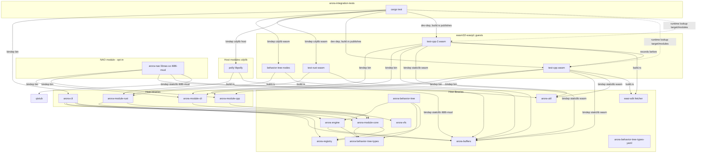

# Semio Arora

Semio Arora is a runtime dedicated to Semio's robotics software.

For a top-down tour of the codebase see [`docs/architecture.md`](docs/architecture.md);
for the *why* behind the build setup and engine layout see
[`docs/design_decisions.md`](docs/design_decisions.md).

## Arora Engine

The engine is the core component, capable of putting together heterogenous modules
under an uniform entry point.

Concretely, the Arora Engine is capable of loading `Module`s
(as defined in [Arora Types](https://docs.rs/arora-types/latest/arora_types/)
["low" `Module`](https://docs.rs/arora-types/latest/arora_types/module/low/struct.ModuleDefinition.html)),
and their binary payload, executed either [natively](crates/arora/src/executor/native.rs),
by [`wasmtime`](crates/arora/src/executor/wasm/mod.rs) or
a [browser host](crates/arora/src/executor/browser/mod.rs).

It loads and exposes the types declared in the modules (`Enumeration`s or `Structure`s),
functions, and provides hooks for the modules to call functions
from the other modules (named `arora_dispatch`),
or anonymous functions registered on-the-fly
(named `arora_dispatch_indirect`).

Note that the module description are described locally using the
[Arora Types crate](https://github.com/semio-ai/arora-types),
differing slightly from the `Module`, `Enumeration` or `Structure` data structures
provided in [Semio Record](https://github.com/semio-ai/semio-record).
See [modules](#modules) and [records](#semio-records)

The main command-line tool is [`arora-cli`](crates/arora-cli/readme.md).
It is used to start an engine, load modules and run functions.
In browsers, the crate [`arora`](crates/arora/readme.md) (the engine's crate),
should already provide similar functions to start an engine.

## Modules

Modules are the building blocks of Semio Arora.
Each module exports symbols for other modules to use.
They can be implemented in C++ and in Rust, compiled into WebAssembly libraries.
The symbols available in a compiled module is described in a `module.yaml` file.
See [test-cpp](modules/test-cpp-2/readme.md),
[test-cpp-2](modules/test-cpp-2/readme.md) or
[test-rust-wasm](modules/test-rust-wasm/readme.md)
for working examples.

Authors of modules should write a `module.yaml` file and
use `arora-module-cli` to generate the adequate sources to implement it.
`arora-module-cli` also produces a `module.yaml` file with named symbols stripped.
This is called a "header", and it is used by the runtime to identify the symbols.
Use `arora-cli --header <module.yaml> --exe <binary>` to try loading a module.

**Important:** The `module.yaml` file is the source of truth. Each module's `build.rs`
regenerates code in `src/arora_generated/` on every build. Manual edits to generated
files will be lost. To add or modify functions, edit `module.yaml` and run
`cargo clean -p <module-name>` to force regeneration. When importing functions from
other modules, add them to both the `imports:` and `dependencies:` sections.
See [`AGENTS.md`](AGENTS.md) for detailed guidance on code generation.

When a function is called (for instance by using `arora-cli --call`),
the call arguments are passed in via a structure which `id`
corresponds to the function to call,
and with arguments `args` represented as structure fields,
associating an `id` to a `value`.
The functions return a structure which `id`
corresponds to the function called.
The first field must be of the same `id` as the function
and contains the return value.
The remaining fields correspond to parameters that the call has mutated.

## Semio Records

This project relies on a notion of records of type
`Enumeration`, `Structure` or `Module`.
They are provided by the following Semio projects:

- [Semio Record](https://github.com/semio-ai/semio-record)
- [Semio Store RPC](https://github.com/semio-ai/semio-store-rpc)
- [Semio Client](https://github.com/semio-ai/semio-client)

They provide the interface to connect to a
[Semio Database](https://github.com/semio-ai/semio-db),
which collects the records of the assets produced by Semio users.

The database does not need to be specified and running at build time.
At runtime, you can specify it by providing a
[Semio Client Configuration](https://github.com/semio-ai/semio-client/blob/master/src/authentication.rs),
with the command-line option `--config`.
A config file is typically produced by [Semio Client (`semio-cli`)](https://github.com/semio-ai/semio-client),
and can be reused in this context.

The types provided by [Semio Records](https://github.com/semio-ai/semio-record),
are usually made available through a [registry](crates/arora-registry/readme.md).
They can be saved into files that can be included by command-line tools.

## Behavior Trees

This project includes
[a library to run behavior trees](https://github.com/semio-ai/arora-behavior-tree),
described with references to functions provided by Arora
[modules](#modules).

Such functions rely on basic types provided as a library by
[`arora-behavior-tree-types`](https://github.com/semio-ai/arora-behavior-tree),
so that Rust bindings can be generated for them using
[`arora-module-rust`](crates/arora-module-rust/readme.md).

They are also available in the YAML format in
[`arora-behavior-tree-types-yaml`](https://github.com/semio-ai/arora-behavior-tree),
so that Rust or C++ bindings can be generated using
[`arora-module-cpp`](crates/arora-module-cpp/readme.md).
See [`arora-registry`](crates/arora-registry/readme.md) to load them
for other uses.

## Full Project Layout

- [Arora Types](https://github.com/semio-ai/arora-types)
  defines the data formats used to communicate between modules,
  and to advertise them locally. Published as an external crate.

- [Arora Buffers](crates/arora-buffers/readme.md),
  provides Rust, C and C++ implementations to read and write buffers.
  Relies on the C / C++ libraries provided in [`libs`](libs).

- [`arora-util`](crates/arora-util/readme.md),
  provides Arora-related utilities for C libraries,
  written in Rust.

- [Arora Engine](crates/arora/readme.md),
  the library of the engine.

- [Arora Registry](crates/arora-registry/readme.md),
  to handle local and remote registry of
  [Semio Records](https://github.com/semio-ai/semio-record).

- [Arora CLI](crates/arora-cli/readme.md),
  the CLI tool to load modules and run functions.

- [Arora Web](https://github.com/semio-ai/arora-sdk),
  a `wasm-bindgen` entry point that hosts the engine inside a browser
  (browser-native `WebAssembly` instead of wasmtime).

- [`arora-vfs`](crates/arora-vfs/readme.md),
  provides a virtual file system mostly used in code generation.
  It is potentially useful for WebAssembly modules.

- Arora Module libraries:
  - [`arora-module-core`](crates/arora-module-core/readme.md):
    a library to analyze type and module declarations,
    and resolve them for code generation.
  - [`arora-module-cli`](crates/arora-module-cli/readme.md):
    a library to generate code from a module description.
    It finds the various code generators locally.
  - [`arora-module-rust`](crates/arora-module-rust/readme.md):
    the Rust code generator for modules.
    Also works as a library.
  - [`arora-module-cpp`](crates/arora-module-cpp/readme.md):
    the C++ code generator for modules.
    Only works as a executable.

- Modules:
  - [`test-cpp`](modules/test-cpp/readme.md):
    a module to test the C++ bindings.
  - [`test-cpp-2`](modules/test-cpp-2/readme.md):
    a module to test the C++ that depends on
    [`test-cpp`](modules/test-cpp/readme.md)
    and [`behavior-tree-types-yaml`](https://github.com/semio-ai/arora-behavior-tree).
  - [Rust WASM test module](modules/test-rust-wasm/readme.md):
    a module to test the Rust bindings, that depends on
    [`behavior-tree-types`](https://github.com/semio-ai/arora-behavior-tree).
  - [Behavior Tree Nodes](https://github.com/semio-ai/arora-behavior-tree):
    an initial collection of behavior tree nodes as module functions.
  - [NAO](https://github.com/semio-ai/arora-sdk): a tentative module for NAO support.
  - [Polly](https://github.com/semio-ai/arora-sdk): a module providing nodes for AWS Polly TTS.

- Behavior Tree:
  - [Types](https://github.com/semio-ai/arora-behavior-tree):
    basic types used in behavior trees.
  - [Types YAML](https://github.com/semio-ai/arora-behavior-tree):
    the same types serialized as YAML.
  - [Behavior Tree](https://github.com/semio-ai/arora-behavior-tree):
    the Arora-specific library to run behavior trees.

## Building

The build is driven by Cargo. The repo is a single workspace pinned to
nightly (`rust-toolchain.toml`) so that the
[`bindeps`](https://doc.rust-lang.org/cargo/reference/unstable.html#artifact-dependencies)
unstable feature is available: cross-target artifacts (wasm guests,
static libs, host code generators) are expressed as artifact
dependencies and resolved by cargo itself. There is no top-level CMake;
C++ modules each carry their own `CMakeLists.txt` invoked from a
`build.rs` via the `cmake` crate.

### Prerequisites

- Rust nightly with the standard toolchain. The pinned `rust-toolchain.toml`
  also requests the `wasm32-wasip1`, `wasm32-wasip2`, and
  `i686-unknown-linux-musl` targets.
- A working C/C++ compiler for the host (Xcode CLT on macOS, gcc/clang on
  Linux).
- For the NAO target (Mac, opt-in): `brew install messense/macos-cross-toolchains/i686-unknown-linux-musl`.
- The WASI SDK is downloaded automatically by `crates/wasi-sdk` into
  `target/wasi-sdk-33/` on first use; no manual install needed.

### Build

```bash
cargo build --workspace
```

This produces:

- Host binaries (`arora-cli`, `arora-module-cli`, `arora-module-cpp`, …)
  under `target/<profile>/`.
- Host cdylibs for native modules (`libpolly.dylib` / `.so`).
- C++ wasm guests (`test-cpp.wasm`, `test-cpp-2.wasm`) staged under
  `target/<profile>/modules/`.
- Rust modules (`behavior-tree-nodes`, `test-rust-wasm`) built for the
  **host** by default — `cargo test -p test-rust-wasm` runs natively.
  Their wasm flavour is produced on demand (see *Testing* below).

The NAO module is opt-in and requires the i686-unknown-linux-musl cross-toolchain:

```bash
cargo build -p arora-nao
```

It cross-compiles to `i686-unknown-linux-musl`, producing
`target/debug/modules/libnao.so` linked against libqi (fetched via CMake
`FetchContent` on first build; expect ~10 min cold).

### Testing

Mirror what CI does (release shown; drop `--release` for a debug run):

```bash
cargo build --release
cargo test --release
```

`cargo test` is self-sufficient: the `arora-behavior-tree` and
`arora-integration-tests` crates declare the wasm guests
(`behavior-tree-nodes`, `test-rust-wasm`) and `polly` as artifact
dependencies, so running the tests builds the `wasm32-wasip1` guests on its
own and the tests find them through env vars forwarded by their `build.rs`
(`CARGO_CDYLIB_FILE_*`). No separate `cargo build --target wasm32-wasip1` is
needed. The `test-cpp` / `test-cpp-2` wasm (plus their `module.yaml` /
`records/`) are published by those modules' `build.rs` under
`target/<profile>/modules/` and read by path.

All three integration tests run green from a clean build:
`call_polly_from_engine`, `call_test_rust_wasm_from_engine`, and the
C++-into-wasm `call_test_cpp_2_from_engine_with_struct` (multi-module
`--call`). None is `#[ignore]`d — the earlier arora-cli tokio-runtime issue
on multi-module calls was fixed by reusing the caller's runtime.

### Browser target

The engine also builds for `wasm32-unknown-unknown`. The `arora-web`
crate is the JS-facing wrapper; it hosts guest modules through the
browser's native `WebAssembly` runtime (no wasmtime).

```bash
wasm-pack build --target web --dev crates/arora-web
GECKODRIVER=$(which geckodriver) wasm-pack test --headless --firefox crates/arora-web
crates/arora-web/www/serve.sh    # demo page on :8080
```

> `wasm-pack test` requires flags **before** the crate path.
>
> On Apple Silicon, the `geckodriver` wasm-pack auto-downloads is
> x86_64-only and SIGABRTs under Rosetta. Install a native arm64
> build (`brew install geckodriver`) and point at it via the
> `GECKODRIVER` env var. The same applies to `--chrome` /
> `chromedriver`.

See [`crates/arora-web/readme.md`](https://github.com/semio-ai/arora-sdk) for
details.

### Dependency overview



Solid arrows are `cargo` dependency edges (regular, build-, or
artifact-dependencies); dotted arrows are runtime lookups that rely on a
prior build. Bindeps surface paths to the consumer's `build.rs` as
environment variables, so each consumer can splice the cross-built artefact
into its own cmake / linker invocation without a recursive cargo call. **The
names have a sharp edge:** for host **bins** the short `CARGO_BIN_FILE_<DEP>`
works (bin names keep dashes), but for **staticlib/cdylib** crates with a
dashed name cargo only sets `CARGO_<KIND>_FILE_<DEP>_<lib>` (lib name,
dashes→underscores, e.g. `CARGO_STATICLIB_FILE_ARORA_BUFFERS_arora_buffers`)
and `CARGO_<KIND>_DIR_<DEP>` — *not* the bare `CARGO_<KIND>_FILE_<DEP>`. Read
the suffixed or `DIR` form (see `modules/test-cpp/build.rs`).

What the integration test crate actually drags in:

- **`behavior-tree-nodes`** as `artifact = "cdylib", target = "wasm32-wasip1"` — forces a wasm32-wasip1 build of the Rust behavior-tree-nodes module and exposes the path to its `.wasm`.
- **`test-rust-wasm`** as `artifact = "cdylib", target = "wasm32-wasip1"` — same, for the Rust test module.
- **`arora-cli`** as `artifact = "bin"` and **`polly`** as
  `artifact = "cdylib"` (host) — `tests/build.rs` forwards their paths to the
  test binary, which reads `ARORA_CLI_BIN` and `CARGO_CDYLIB_FILE_POLLY_polly`.
- **`test-cpp`** and **`test-cpp-2`** are plain **dev-dependencies** (not
  bindeps): listing them makes `cargo test` run their `build.rs`, which builds
  the wasm via cmake and publishes `*.wasm` / `module.yaml` / `records/` under
  `target/<profile>/modules/`. The C++ integration test reads those published
  files by path. (They are excluded from `default-members`, so a bare
  `cargo build` does not build them — `cargo test` does.)

### Build flags & options

- `cargo build -p arora-nao` — builds the NAO cross-compile (opt-in; requires
  i686-unknown-linux-musl toolchain). NAO is excluded from `default-members`,
  so `cargo build --workspace` skips it.
- `cargo build --release` for an optimized build; the release profile
  pins `lto = "thin"` and `debug = 1`.

The individual C++ modules' `CMakeLists.txt` files remain invokable
standalone with `-D` overrides, mainly for IDE integration; the
authoritative entry point is `cargo`.

